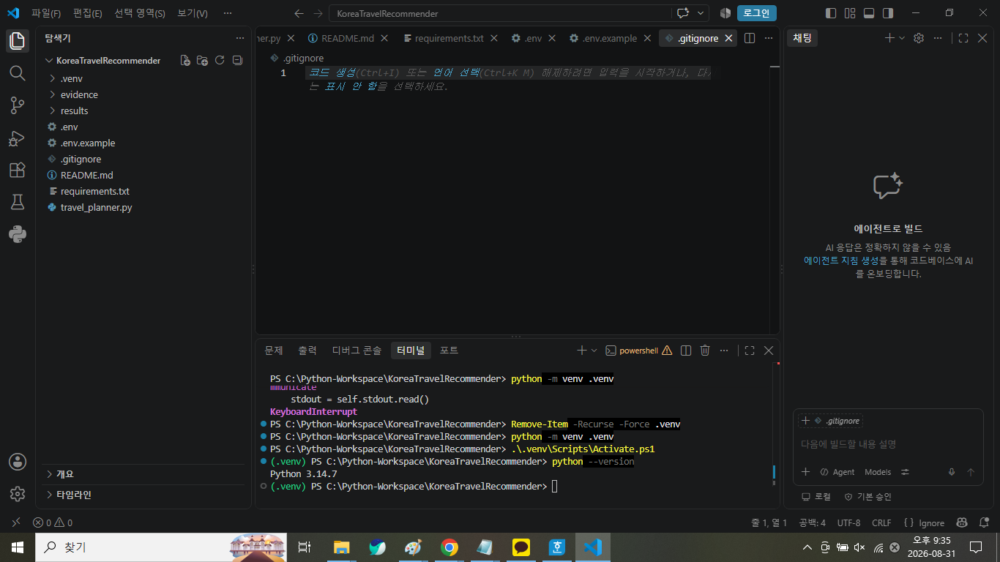
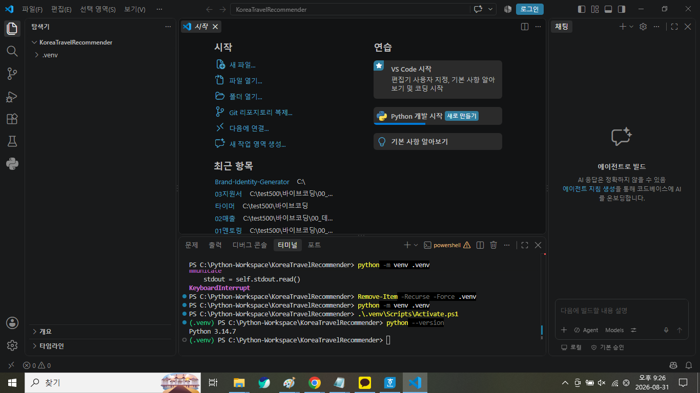
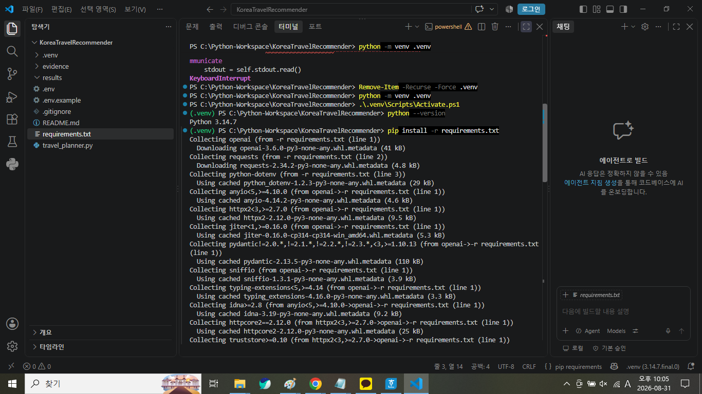
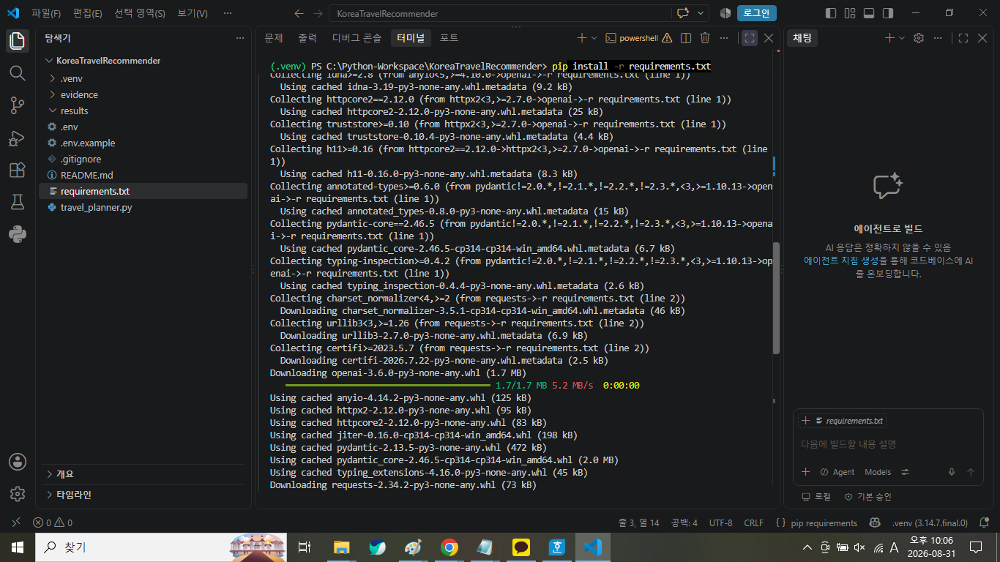
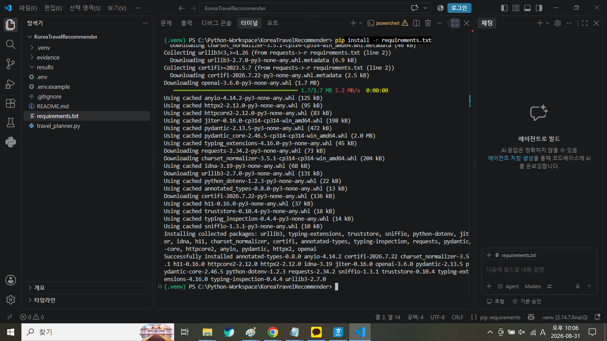
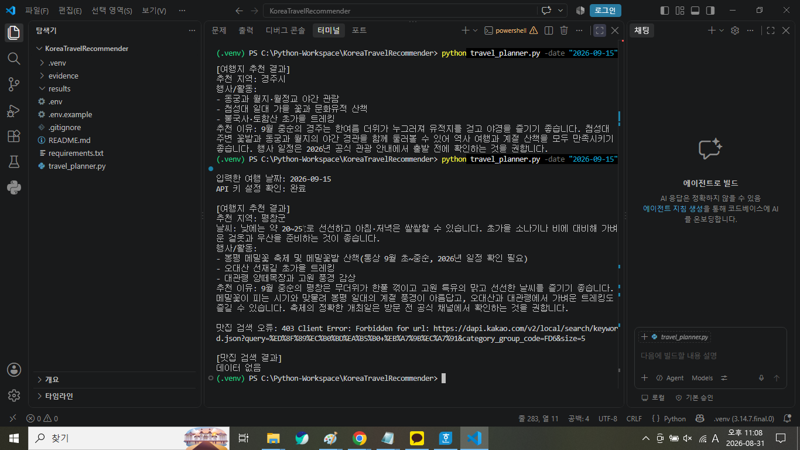
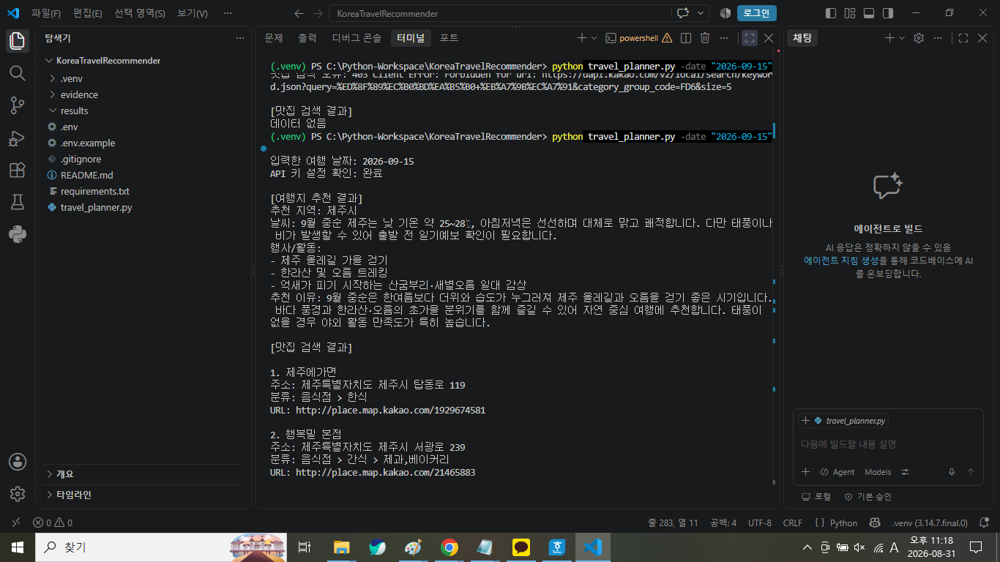
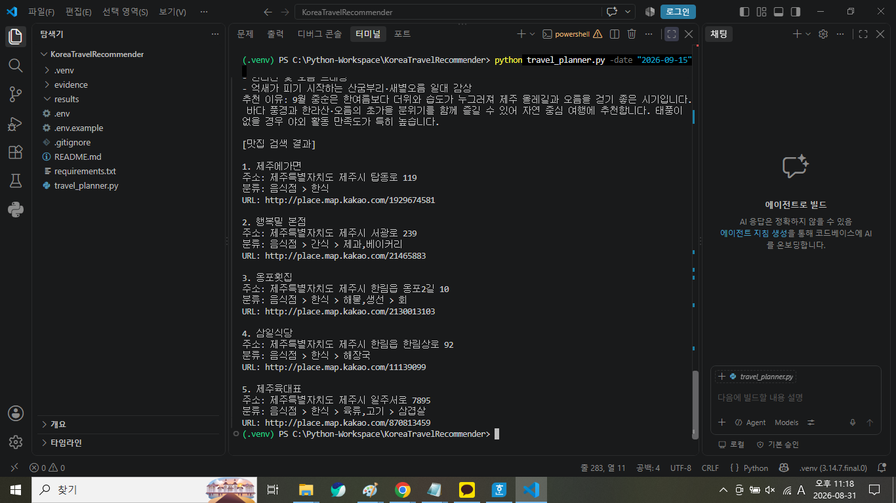

# 국내 여행지 추천 프로그램

OpenAI API와 Kakao Local API를 활용하여 사용자가 입력한 여행 날짜를 기준으로 서로 다른 국내 여행지 3곳을 추천하고, 추천 지역별 맛집 정보와 여행 일정을 포함한 최종 Markdown 여행 안내서를 생성하는 Python CLI 프로그램입니다.

## 1. 프로젝트 소개

### 1-1. 프로젝트 목적

이 프로젝트는 사용자가 입력한 여행 날짜를 바탕으로 국내 여행지를 추천하고, 추천된 지역의 맛집 정보를 검색한 뒤 이를 하나의 여행 안내서로 생성하는 Python CLI 프로그램을 구현하는 것을 목적으로 합니다.

단순히 하나의 API 결과를 출력하는 방식이 아니라 OpenAI API에서 생성한 여행지 추천 결과를 Kakao Local API의 입력값으로 연결하고, 다시 여행지 추천 정보와 맛집 검색 결과를 결합하여 최종 여행 안내서를 생성하도록 구성하였습니다.

이를 통해 REST API 호출, JSON 데이터 처리, 복수 API 간 데이터 연결, 예외 처리, API Key 보안 관리 및 결과 파일 저장 과정을 하나의 프로그램에서 구현하였습니다.

### 1-2. 주요 기능

프로그램의 주요 기능은 다음과 같습니다.

- `-date "YYYY-MM-DD"` 형식의 여행 날짜 입력
- 입력 날짜의 형식 및 실제 존재하는 날짜 여부 검증
- OpenAI API를 이용한 서로 다른 국내 여행지 3곳 추천
- 추천 결과를 JSON 형태로 구조화하여 처리
- 각 추천 지역의 `recommended_city` 값을 Kakao Local API의 검색 입력값으로 사용
- Kakao Local API를 이용한 추천 지역별 맛집 검색
- 지역별 최대 5개의 맛집 정보 수집
- 맛집 정보를 `restaurants_by_city`에 지역별로 구분하여 저장
- 여행지 추천 정보와 맛집 정보를 결합한 최종 Markdown 여행 안내서 생성
- 추천 지역별 오전·오후·저녁 일정 생성
- 원본 JSON과 최종 Markdown 결과를 `results/` 폴더에 저장
- LLM JSON 파싱 실패 시 최대 1회 재시도
- 장소/맛집 검색 API 오류 발생 시 비치명적 오류로 기록하고 가능한 범위에서 계속 진행
- API Key를 `.env` 환경변수로 관리
- 동일 날짜의 기존 JSON 및 Markdown 결과를 이용한 캐싱
- 복수 지역 추천 및 지역별 맛집 검색

## 2. API 간 데이터 연결

### 2-1. API 간 데이터 연결 방법

이 프로그램은 OpenAI API와 Kakao Local API를 각각 독립적으로 사용하는 것이 아니라 앞 단계에서 생성된 데이터를 다음 API의 입력값으로 전달하는 방식으로 연결하였습니다.

먼저 사용자가 다음과 같이 여행 날짜를 입력합니다.

```text
python travel_planner.py -date "2026-09-15"
```

입력한 여행 날짜는 OpenAI API에 전달되며, OpenAI API에서는 서로 다른 국내 여행지 3곳을 추천합니다.

여행지 추천 결과는 `recommendations` 배열에 저장하며, 각 추천 결과에는 다음 항목이 포함됩니다.

```text
recommended_city
weather
events
reason
```

이 중 `recommended_city` 값을 추출하여 다음 단계인 Kakao Local API의 맛집 검색에 사용합니다.

실제 `2026-09-15` 실행에서는 다음 세 지역이 추천되었습니다.

```text
제주시
경주시
강릉시
```

각 지역명에 `맛집`을 결합하여 Kakao Local API 검색어로 사용합니다.

```text
제주시 → 제주시 맛집
경주시 → 경주시 맛집
강릉시 → 강릉시 맛집
```

Kakao Local API에서 반환된 장소 정보 중 다음 항목을 추출하여 사용합니다.

```text
place_name
address
category
url
```

검색된 맛집 정보는 추천 지역명을 기준으로 `restaurants_by_city`에 지역별로 저장합니다.

전체 API 연결 흐름은 다음과 같습니다.

```text
사용자 여행 날짜 입력
        ↓
OpenAI API
여행지 3곳 추천
        ↓
JSON 응답 파싱
        ↓
recommended_city 추출
        ↓
Kakao Local API
추천 지역별 맛집 검색
        ↓
restaurants_by_city에 지역별 저장
        ↓
여행지 추천 정보 + 맛집 정보 결합
        ↓
OpenAI API
최종 여행 안내서 생성
        ↓
원본 JSON + Markdown 저장
```

마지막으로 첫 번째 OpenAI API 요청에서 생성한 여행지 추천 정보와 Kakao Local API에서 얻은 지역별 맛집 정보를 다시 OpenAI API에 전달합니다.

이를 이용하여 추천 지역별 추천 이유, 날씨 및 여행 준비 정보, 행사·활동, 맛집 정보와 오전·오후·저녁 일정이 포함된 최종 Markdown 여행 안내서를 생성합니다.

이와 같이 첫 번째 API의 출력값인 `recommended_city`를 두 번째 API의 입력값으로 사용하고, 두 API에서 얻은 결과를 다시 결합하여 최종 결과 생성에 활용하도록 구현하였습니다.


## 3. Project Folder 구조

Project의 주요 File과 Folder는 다음과 같이 구성하였습니다.

```text
KoreaTravelRecommender/
├─ evidence/
│  └─ 실행 및 Test 증빙 이미지
├─ results/
│  ├─ YYYY-MM-DD_raw.json
│  └─ YYYY-MM-DD_travel_guide.md
├─ .env.example
├─ .gitignore
├─ README.md
├─ requirements.txt
└─ travel_planner.py
```



**그림 3-1. VS Code Project Folder 구조 확인**

VS Code 탐색기를 통해 `evidence/`, `results/`, `.env.example`, `.gitignore`, `README.md`, `requirements.txt`, `travel_planner.py` 등 Project의 주요 File과 Folder가 구성되어 있음을 확인하였습니다.

실제 API Key가 저장된 `.env` 파일은 Local 실행 환경에서만 사용하며, API Key 보호를 위해 최종 제출 압축 파일에는 포함하지 않습니다.

## 4. 개발 환경 및 설치

### 4-1. Python Version 확인

실제 확인 Version: **Python 3.14.7**



**그림 4-1. Python Version 확인 결과**  
가상환경을 활성화한 후 `python --version` 명령어를 실행하여 Python 3.14.7이 정상적으로 사용되고 있음을 확인하였다.

### 4-2. 가상환경 생성 및 활성화

프로젝트별 Python Package를 독립적으로 관리하기 위해 `.venv` 가상환경을 사용하였습니다.

#### Windows PowerShell

가상환경 생성:

```powershell
python -m venv .venv
```

가상환경 활성화:

```powershell
.\.venv\Scripts\Activate.ps1
```

가상환경이 정상적으로 활성화되면 터미널 명령 프롬프트 앞에 `(.venv)`가 표시됩니다.



**그림 4-2. 가상환경 생성 및 활성화 결과**

`python -m venv .venv` 명령어로 `.venv` 가상환경을 생성하고 `.\.venv\Scripts\Activate.ps1` 명령어로 활성화한 결과, 터미널 앞에 `(.venv)`가 표시되는 것을 확인하였습니다.

#### macOS / Linux

가상환경 생성:

```bash
python3 -m venv .venv
```

가상환경 활성화:

```bash
source .venv/bin/activate
```

### 4-3. 필요한 Package 설치

프로그램 실행에 필요한 Python Package는 `requirements.txt`에 작성하였습니다.

가상환경을 활성화한 상태에서 다음 명령어를 실행하여 필요한 Package를 설치합니다.

```powershell
pip install -r requirements.txt
```

현재 프로젝트에서는 OpenAI API 호출, Kakao Local API 요청 및 `.env` 환경변수 사용에 필요한 Package를 `requirements.txt`를 통해 관리합니다.

먼저 가상환경이 활성화된 상태에서 `pip install -r requirements.txt` 명령어를 실행하였습니다.


**그림 4-3-1. 필요한 Package 설치 명령 실행**

`pip install -r requirements.txt` 명령어를 실행하여 `requirements.txt`에 작성된 Package 설치를 시작하였습니다.



**그림 4-3-2. 필요한 Package 다운로드 및 설치 과정**

OpenAI, requests, python-dotenv 등 프로그램 실행에 필요한 Package와 관련 의존성 Package가 다운로드 및 설치되는 과정을 확인하였습니다.



**그림 4-3-3. 필요한 Package 설치 완료 결과**

설치 마지막 단계에서 `Successfully installed` 메시지가 출력되어 프로그램 실행에 필요한 Package가 정상적으로 설치된 것을 확인하였습니다.

## 5. API 제공자

### 5-1. LLM API

사용 API: OpenAI API

사용 모델: `gpt-5.6-luna`

선택 이유:

사용자가 입력한 여행 날짜를 바탕으로 국내 여행지를 추천하고, 날씨, 행사·활동, 추천 이유 등의 정보를 구조화된 형태로 생성하기 위해 OpenAI API를 사용하였습니다.

또한 1차 여행지 추천 결과와 Kakao Local API의 맛집 검색 결과를 결합하여 최종 Markdown 여행 안내서를 생성하는 데 활용하였습니다.

### 5-2. 지도/장소 검색 API

사용 API: Kakao Local API

검색 대상: 추천 지역의 음식점 및 맛집

검색 기준:

OpenAI API가 추천한 지역명을 이용하여 `추천지역 + 맛집` 형식의 검색어를 생성합니다.

예:

```text
제주시 맛집
경주시 맛집
강릉시 맛집
```

음식점 카테고리 코드 `FD6`를 사용하여 지역별 최대 5곳을 검색하도록 구성하였습니다.

선택 이유:

LLM이 임의로 맛집 정보를 생성하도록 하지 않고, 실제 장소 검색 API에서 제공하는 음식점 정보를 여행 안내서에 활용하기 위해 Kakao Local API를 사용하였습니다.

주요 활용 정보:

- 맛집명
- 주소
- 음식점 분류
- Kakao 지도 URL

### 5-3. 장소 데이터 필드

Kakao Local API의 검색 결과에서 다음 필드를 가져와 프로그램의 맛집 정보로 저장합니다.

| 프로그램 필드 | API 원본 필드 | 설명 |
|---|---|---|
| `place_name` | `place_name` | 장소명 또는 맛집명 |
| `address` | `road_address_name` 또는 `address_name` | 도로명 주소를 우선 사용하고, 없는 경우 지번 주소 사용 |
| `category` | `category_name` | 장소의 카테고리 및 음식점 분류 |
| `url` | `place_url` | Kakao 지도 장소 상세 URL |

현재 프로그램에서는 Kakao Local API가 제공하는 좌표 정보인 `x`(경도)와 `y`(위도)는 최종 맛집 데이터에 저장하지 않습니다.

Kakao Local API에서 받은 원본 데이터 중 필요한 값을 추출하여 프로그램에서 사용하는 필드 구조로 정리하고, 이후 최종 여행 안내서 생성 시 OpenAI API에 전달합니다.

## 6. REST API 요청/응답 구조

### 6-1. REST API란?

REST API는 서로 다른 프로그램이나 서비스가 HTTP를 이용하여 데이터를 요청하고 응답받을 수 있도록 하는 방식입니다.

이 프로젝트에서는 OpenAI API와 Kakao Local API를 이용하여 서로 다른 서비스의 데이터를 연결하였습니다.

전체적인 데이터 흐름은 다음과 같습니다.

```text
사용자 여행 날짜 입력
        ↓
OpenAI API 여행지 추천
        ↓
추천 지역명 추출
        ↓
Kakao Local API 맛집 검색
        ↓
여행지 추천 + 맛집 데이터 결합
        ↓
OpenAI API 최종 여행 안내서 생성
```

### 6-2. GET과 POST의 차이

| 구분 | GET | POST |
|---|---|---|
| 주요 목적 | 서버에서 데이터를 조회하거나 검색 | 서버에 데이터를 전달하여 처리 또는 생성을 요청 |
| 이 프로그램에서 사용한 곳 | Kakao Local API 맛집 검색 | OpenAI API 여행지 추천 및 최종 여행 안내서 생성 |
| 전달 방법 | URL의 Query Parameter와 HTTP Header를 이용 | API 요청 본문에 입력 데이터 및 프롬프트 등을 전달 |

#### GET

이 프로젝트에서는 Kakao Local API로 맛집을 검색할 때 GET 방식의 요청을 사용합니다.

추천 지역명을 이용하여 `추천지역 + 맛집` 형태의 검색어를 만들고, 음식점 카테고리와 검색 개수 등의 조건을 Query Parameter로 전달합니다.

예:

`제주시 맛집`

검색 조건:

- `query`: 추천 지역 + 맛집
- `category_group_code`: `FD6`
- `size`: `5`

API 인증을 위해 HTTP Header에 Kakao REST API Key를 전달합니다.


#### POST

OpenAI API를 이용한 여행지 추천과 최종 여행 안내서 생성에서는 OpenAI Python SDK를 통해 API 요청을 수행합니다.

1차 요청에서는 사용자가 입력한 여행 날짜를 전달하여 서로 다른 국내 여행지 3곳의 추천 정보를 생성합니다.

최종 요청에서는 1차 여행지 추천 정보와 Kakao Local API에서 검색한 지역별 맛집 정보를 함께 전달하여 최종 Markdown 여행 안내서를 생성합니다.


### 6-3. 이 프로그램의 API 호출

#### LLM 1차 추천

HTTP 방식: POST

입력:

- 사용자가 `-date` 옵션으로 입력한 여행 날짜
- 형식: `YYYY-MM-DD`
- 예: `2026-09-15`

출력:

- 서로 다른 국내 여행지 3곳의 구조화된 추천 정보
- `recommended_city`: 추천 지역
- `weather`: 해당 시기의 일반적인 날씨
- `events`: 행사 또는 계절 활동
- `reason`: 추천 이유

OpenAI API의 구조화된 응답 기능을 이용하여 추천 결과를 `TravelRecommendations` 형식으로 처리합니다.

#### 장소/맛집 검색

HTTP 방식: GET

검색 조건:

- 검색어: `추천지역 + 맛집`
- 예: `제주시 맛집`
- 음식점 카테고리 코드: `FD6`
- 지역별 최대 검색 개수: `5`

출력:

- `place_name`: 맛집명
- `address`: 주소
- `category`: 음식점 분류
- `url`: Kakao 지도 장소 URL

OpenAI API가 추천한 각 지역을 순회하면서 Kakao Local API를 호출하고, 검색된 맛집 정보를 `restaurants_by_city`에 지역별로 저장합니다.

#### 최종 여행 안내서 생성

HTTP 방식: POST

입력:

- 여행 날짜
- 1차 LLM에서 생성한 지역별 여행지 추천 정보
- 각 지역의 날씨 정보
- 행사·활동 정보
- 추천 이유
- Kakao Local API에서 검색한 지역별 맛집 정보

출력:

- Markdown 형식의 최종 국내 여행 안내서
- 추천 지역
- 추천 이유
- 날씨 및 여행 준비 정보
- 행사·활동
- 맛집
- 오전 일정
- 오후 일정
- 저녁 일정

생성된 최종 여행 안내서는 다음 파일로 저장합니다.

```text
results/YYYY-MM-DD_travel_guide.md
```


## 7. API 키 설정

### 7-1. 필요한 환경변수

프로그램 실행을 위해 다음 두 환경변수가 필요합니다.

```text
OPENAI_API_KEY=YOUR_OPENAI_API_KEY
KAKAO_REST_API_KEY=YOUR_KAKAO_REST_API_KEY
```

실제 API Key는 Python 코드나 README에 직접 작성하지 않습니다.

프로그램은 실행 시 `OPENAI_API_KEY`와 `KAKAO_REST_API_KEY`가 설정되어 있는지 확인하며, 필요한 API Key가 설정되어 있지 않은 경우 API 호출을 진행하지 않고 어떤 환경변수가 필요한지 안내한 후 프로그램을 종료하도록 구성하였습니다.

실제 API Key는 `.env` 파일 또는 운영체제의 환경변수를 통해 관리합니다.

### 7-2. `.env` 사용

API Key는 소스 코드에 직접 작성하지 않고 `.env` 파일을 이용하여 관리합니다.

`.env` 파일은 다음과 같은 형식으로 작성합니다.

```text
OPENAI_API_KEY=YOUR_OPENAI_API_KEY
KAKAO_REST_API_KEY=YOUR_KAKAO_REST_API_KEY
```

실제 로컬 실행에 사용하는 `.env` 파일에는 실제 API Key를 설정합니다.

반면 제출 및 공유를 위한 `.env.example` 파일에는 필요한 환경변수 이름과 예시 값만 작성하며, 실제 API Key는 포함하지 않습니다.

또한 실제 API Key가 저장된 `.env` 파일은 `.gitignore`에 등록하여 Git 저장소에 업로드되지 않도록 관리하고, 최종 제출 압축 파일에도 포함하지 않습니다.

### 7-3. Windows PowerShell 환경변수 설정

Windows PowerShell에서는 다음과 같이 환경변수를 설정할 수 있습니다.

```powershell
$env:OPENAI_API_KEY="YOUR_OPENAI_API_KEY"
$env:KAKAO_REST_API_KEY="YOUR_KAKAO_REST_API_KEY"
```

설정한 환경변수는 현재 PowerShell 세션에서 프로그램 실행에 사용할 수 있습니다.

### 7-4. macOS / Linux 환경변수 설정

macOS 또는 Linux에서는 다음과 같이 환경변수를 설정할 수 있습니다.

```bash
export OPENAI_API_KEY="YOUR_OPENAI_API_KEY"
export KAKAO_REST_API_KEY="YOUR_KAKAO_REST_API_KEY"
```

실제 API Key 값은 README나 제출 파일에 작성하지 않고 사용자의 로컬 실행 환경에서만 설정합니다.


## 8. API Key 보안

### 8-1. API 키를 코드에 작성하지 않는 이유

API Key는 외부 서비스를 사용할 수 있는 중요한 인증 정보이므로 Python 코드에 직접 작성하지 않습니다.

API Key를 코드와 분리하여 관리하면 다음과 같은 장점이 있습니다.

- 소스 코드를 공유하거나 협업하는 과정에서 API Key가 외부에 공개되는 것을 방지할 수 있습니다.
- API Key를 변경하더라도 소스 코드를 직접 수정할 필요 없이 환경변수만 변경하여 사용할 수 있습니다.
- API Key 유출로 인한 무단 사용과 예상하지 못한 과금 및 API 사용량(쿼터) 소진을 예방할 수 있습니다.

실제 API Key는 `.env` 파일 또는 운영체제의 환경변수를 통해 관리하며, 실제 Key 값을 README나 코드에 기록하지 않습니다.

### 8-2. `.gitignore`

API Key가 저장된 `.env` 파일과 불필요한 가상환경 및 Python Cache File이 Git에 업로드되지 않도록 `.gitignore`에 다음 항목을 등록합니다.

```text
.env
.venv/
__pycache__/
*.pyc
```

이를 통해 실제 API Key가 포함된 `.env` 파일이 실수로 Git 저장소에 포함되는 것을 방지합니다.

### 8-3. 제출 전 보안 확인 ⭐

- [ ] Python 코드에 실제 API Key가 포함되어 있지 않은지 확인
- [ ] README에 실제 API Key가 포함되어 있지 않은지 확인
- [ ] 실행 Log에 실제 API Key가 노출되지 않는지 확인
- [ ] JSON 결과 파일에 실제 API Key가 포함되어 있지 않은지 확인
- [ ] Markdown 결과 파일에 실제 API Key가 포함되어 있지 않은지 확인
- [ ] 실제 API Key가 저장된 `.env` 파일을 제출하지 않았는지 확인
- [ ] `.env.example`에는 실제 API Key가 아닌 예시 값만 포함되어 있는지 확인
- [ ] `.gitignore` 파일명이 정확히 `.gitignore`인지 확인
- [ ] `.env.example` 파일명이 정확히 `.env.example`인지 확인


## 9. CLI 사용 방법

### 9-1. 기본 실행

프로그램은 여행 날짜를 `-date` 옵션으로 입력하여 실행합니다.

실행 형식:

```powershell
python travel_planner.py -date "YYYY-MM-DD"
```

실제 실행 예:

```powershell
python travel_planner.py -date "2026-09-15"
```

입력한 날짜는 `YYYY-MM-DD` 형식인지 확인한 후 프로그램에서 사용합니다.


### 9-2. 정상 실행 화면

올바른 여행 날짜와 필요한 API Key가 설정된 상태에서 프로그램을 실행하면 여행지 추천, 지역별 맛집 검색, 최종 여행 안내서 생성 및 결과 저장 과정이 진행됩니다.

실행 예:

```powershell
python travel_planner.py -date "2026-09-15"
```

정상 실행 시 입력한 여행 날짜와 API Key 설정 여부를 확인하고, 여행지 추천 결과와 지역별 맛집 검색 결과를 출력합니다.

이후 최종 여행 안내서를 생성하고 다음 두 파일에 결과를 저장합니다.

```text
results/2026-09-15_raw.json
results/2026-09-15_travel_guide.md
```

이미 같은 날짜의 정상 결과가 저장되어 있는 경우에는 캐싱 기능에 의해 기존 결과를 불러오므로 API를 다시 호출하지 않습니다.


### 9-3. 날짜 입력 검증

`-date` 옵션으로 입력받은 날짜는 `YYYY-MM-DD` 형식으로 검증합니다.

예를 들어 다음과 같이 잘못된 형식의 날짜를 입력하면 프로그램이 정상적인 여행 날짜로 처리하지 않고 오류를 안내합니다.

```powershell
python travel_planner.py -date "2026/09/15"
```

또한 형식은 맞더라도 실제로 존재하지 않는 날짜는 허용하지 않습니다.

예:

```powershell
python travel_planner.py -date "2026-02-30"
```

따라서 프로그램은 날짜의 형식뿐만 아니라 실제 존재하는 날짜인지도 확인한 후 다음 단계로 진행합니다.


### 9-4. 필수 옵션 누락

`-date`는 프로그램 실행에 필요한 필수 옵션입니다.

따라서 다음과 같이 `-date`를 입력하지 않고 실행하면 프로그램은 여행지 추천 API를 호출하지 않고 명령행 사용법과 오류 메시지를 출력한 후 종료합니다.

```powershell
python travel_planner.py
```

이를 통해 여행 날짜가 없는 상태에서 프로그램이 실행되는 것을 방지합니다.


### 9-5. 도움말

다음 명령어를 사용하면 프로그램의 CLI 사용 방법을 확인할 수 있습니다.

```powershell
python travel_planner.py --help
```

도움말에서는 프로그램의 사용법과 `-date` 옵션에 대한 설명을 확인할 수 있습니다.

이를 통해 사용자는 프로그램을 실행하기 전에 필요한 명령행 옵션과 여행 날짜 입력 방법을 확인할 수 있습니다.

   ## 10. 1차 LLM 여행지 추천

### 10-1. 입력

1차 LLM 여행지 추천에서는 사용자가 CLI의 `-date` 옵션으로 입력한 여행 날짜를 사용합니다.

실제 실행에 사용한 날짜:

```text
2026-09-15
```

실행 명령어:

```powershell
python travel_planner.py -date "2026-09-15"
```

입력한 여행 날짜는 `YYYY-MM-DD` 형식으로 검증한 후 OpenAI API의 여행지 추천 요청에 전달합니다.


### 10-2. 프롬프트 설계

사용자가 입력한 여행 날짜를 OpenAI API에 전달하고, 해당 날짜를 기준으로 서로 다른 국내 여행지 3곳을 추천하도록 프롬프트를 구성하였습니다.

프롬프트에서는 각 추천 결과에 다음 정보가 포함되도록 지정하였습니다.

- `recommended_city`: 대한민국의 시 또는 군 단위 추천 지역명
- `weather`: 해당 시기의 일반적인 날씨 특징
- `events`: 해당 날짜 전후에 고려할 만한 행사 또는 계절 활동 1~3개
- `reason`: 해당 지역을 추천하는 이유 2~4문장

실제 프로그램에서 사용하는 주요 지시 내용은 다음과 같습니다.

```text
당신은 대한민국 국내 여행 전문가입니다.
사용자가 입력한 여행 날짜를 기준으로
서로 다른 국내 여행지 3곳을 추천하세요.

recommended_city에는 대한민국의 시 또는 군 단위 지역명을 작성하세요.
weather에는 해당 시기의 일반적인 날씨 특징을 간단히 작성하세요.
events에는 해당 날짜 전후에 고려할 만한 행사나 계절 활동을
1개 이상 3개 이하로 작성하세요.
reason에는 추천 이유를 한국어 2~4문장으로 작성하세요.
```

사용자 입력은 다음과 같은 형태로 전달합니다.

```text
여행 날짜: 2026-09-15
```

OpenAI API의 구조화된 응답 기능을 이용하여 결과를 `TravelRecommendations` 형식으로 처리하도록 구현하였습니다.


### 10-3. 필수 JSON 스키마

스키마(Schema)는 데이터가 어떤 항목과 형식으로 구성되어야 하는지를 정해 놓은 구조입니다.

현재 프로그램에서는 하나의 여행지만 반환하는 것이 아니라 서로 다른 국내 여행지 3곳을 `recommendations` 목록에 담아 처리합니다.

구조는 다음과 같습니다.

```json
{
  "recommendations": [
    {
      "recommended_city": "추천 지역 1",
      "weather": "해당 시기의 일반적인 날씨 특징",
      "events": [
        "행사 또는 계절 활동 1",
        "행사 또는 계절 활동 2"
      ],
      "reason": "추천 이유 2~4문장"
    },
    {
      "recommended_city": "추천 지역 2",
      "weather": "해당 시기의 일반적인 날씨 특징",
      "events": [
        "행사 또는 계절 활동"
      ],
      "reason": "추천 이유 2~4문장"
    },
    {
      "recommended_city": "추천 지역 3",
      "weather": "해당 시기의 일반적인 날씨 특징",
      "events": [
        "행사 또는 계절 활동"
      ],
      "reason": "추천 이유 2~4문장"
    }
  ]
}
```

각 추천 결과에는 `recommended_city`, `weather`, `events`, `reason`이 포함되며, 구조화된 결과를 프로그램에서 읽어 다음 단계의 Kakao Local API 맛집 검색에 사용합니다.


### 10-4. 실제 1차 추천 결과

`2026-09-15`를 입력하여 실행한 결과 서로 다른 국내 여행지 3곳이 추천되었습니다.

추천된 지역은 다음과 같습니다.

- 제주시
- 경주시
- 강릉시

각 지역에는 일반적인 날씨 특징, 행사·계절 활동 및 추천 이유가 함께 생성되었습니다.

실제 실행 결과에서는 다음과 같이 지역별 추천 정보가 출력되는 것을 확인하였습니다.

```text
[추천 지역 1]
추천 지역: 제주시
날씨: 9월 중순의 일반적인 날씨 정보
행사/활동:
- 한라산 일대 트레킹
- 오름 풍경 감상
- 제주 해안도로 드라이브
추천 이유: 9월 중순의 제주 여행에 적합한 이유가 출력됨

[추천 지역 2]
추천 지역: 경주시
날씨: 9월 중순의 일반적인 날씨 정보
행사/활동:
- 동궁과 월지·첨성대 일대 야간 산책
- 불국사와 석굴암 문화유산 탐방
- 보문호수 산책
추천 이유: 문화유산과 계절 산책을 중심으로 추천 이유가 출력됨

[추천 지역 3]
추천 지역: 강릉시
날씨: 9월 중순의 일반적인 날씨 정보
행사/활동:
- 경포호·경포해변 산책
- 안목해변 카페거리
- 오죽헌·선교장 문화유산 탐방
추천 이유: 바다와 문화유산을 함께 즐길 수 있는 추천 이유가 출력됨
```


### 10-5. 다음 API로 연결

1차 LLM에서 생성된 3개의 추천 결과를 하나씩 순회하면서 각 결과의 `recommended_city` 값을 Kakao Local API의 입력값으로 사용합니다.

프로그램에서는 추천 지역명에 `"맛집"`을 결합하여 검색어를 생성합니다.

실제 `2026-09-15` 실행 결과에서는 다음과 같이 연결되었습니다.

```text
제주시 → "제주시 맛집"
경주시 → "경주시 맛집"
강릉시 → "강릉시 맛집"
```

각 지역에 대해 Kakao Local API의 음식점 카테고리 `FD6`를 이용하여 최대 5곳의 맛집을 검색합니다.

검색된 결과는 추천 지역명을 키로 사용하는 `restaurants_by_city`에 지역별로 저장합니다.

따라서 1차 LLM의 여행지 추천 결과는 단순히 화면에 출력하거나 저장하는 데 그치지 않고, 다음 단계인 Kakao Local API 맛집 검색의 실제 입력 데이터로 연결됩니다.


## 11. 맛집 검색

### 11-1. 검색 입력

1차 LLM에서 추천된 각 지역의 `recommended_city` 값을 이용하여 Kakao Local API의 맛집 검색어를 생성합니다.

프로그램에서는 추천 지역명 뒤에 `"맛집"`을 결합하여 검색어를 만듭니다.

실제 `2026-09-15` 실행에서는 다음과 같이 검색어가 생성되었습니다.

```text
제주시 → "제주시 맛집"
경주시 → "경주시 맛집"
강릉시 → "강릉시 맛집"
```

추천된 3개 지역을 순서대로 처리하면서 각 지역에 대해 Kakao Local API의 맛집 검색을 수행합니다.


### 11-2. 검색 개수

추천 지역별로 맛집을 최대 5곳까지 검색하도록 설정하였습니다.

Kakao Local API 요청 시 음식점 카테고리 코드 `FD6`를 사용하고 검색 개수 `size`를 `5`로 설정합니다.

따라서 각 추천 지역에서 최대 5개의 음식점 정보를 가져옵니다.

검색 결과가 5곳보다 적은 경우에는 실제 조회된 결과만 사용합니다.

검색 결과가 없는 경우에도 프로그램을 중단하지 않고 빈 목록으로 처리하며, 화면과 최종 여행 안내서에서는 `데이터 없음`으로 처리할 수 있도록 구성하였습니다.


### 11-3. 맛집 데이터 구조

Kakao Local API에서 검색한 각 맛집 정보는 프로그램에서 다음과 같은 구조로 정리하여 사용합니다.

```json
{
  "place_name": "맛집 이름",
  "address": "주소",
  "category": "음식점 분류",
  "url": "Kakao 지도 장소 URL"
}
```

각 필드는 다음과 같이 Kakao Local API의 원본 응답과 연결됩니다.

| 프로그램 필드 | Kakao Local API 원본 필드 | 설명 |
|---|---|---|
| `place_name` | `place_name` | 장소명 또는 맛집명 |
| `address` | `road_address_name` 또는 `address_name` | 도로명 주소를 우선 사용하고 없는 경우 지번 주소 사용 |
| `category` | `category_name` | 음식점 카테고리 |
| `url` | `place_url` | Kakao 지도 장소 상세 URL |

현재 프로그램에서는 Kakao Local API가 제공하는 `x`(경도), `y`(위도) 좌표를 최종 맛집 데이터에 저장하지 않습니다.

검색된 맛집은 추천 지역명을 기준으로 `restaurants_by_city`에 구분하여 저장합니다.

구조 예시는 다음과 같습니다.

```json
{
  "제주시": [
    {
      "place_name": "맛집 이름",
      "address": "주소",
      "category": "음식점 분류",
      "url": "Kakao 지도 URL"
    }
  ],
  "경주시": [
    {
      "place_name": "맛집 이름",
      "address": "주소",
      "category": "음식점 분류",
      "url": "Kakao 지도 URL"
    }
  ],
  "강릉시": [
    {
      "place_name": "맛집 이름",
      "address": "주소",
      "category": "음식점 분류",
      "url": "Kakao 지도 URL"
    }
  ]
}
```


### 11-4. 검색 결과 0건 처리

특정 추천 지역에서 Kakao Local API의 맛집 검색 결과가 0건인 경우에도 프로그램 전체를 오류로 종료하지 않습니다.

해당 지역의 맛집 데이터는 빈 목록으로 처리하고 다른 추천 지역의 맛집 검색을 계속 진행합니다.

예:

```json
{
  "restaurants_by_city": {
    "추천지역": []
  }
}
```

화면 출력에서는 다음과 같이 표시합니다.

```text
[추천지역 맛집 검색 결과]

데이터 없음
```

최종 여행 안내서 생성 시에도 해당 추천 지역 자체를 제외하지 않고 맛집 정보를 `데이터 없음`으로 전달하여 나머지 여행 정보를 계속 작성할 수 있도록 구성하였습니다.

이를 통해 맛집 검색 결과가 없는 경우에도 추천 지역, 날씨, 행사·활동, 추천 이유 및 여행 일정 등 다른 정보를 정상적으로 처리할 수 있습니다.


    ## 12. 최종 여행 안내서 생성

### 12-1. LLM 입력 데이터

최종 여행 안내서를 생성하기 위해 1차 OpenAI API에서 생성한 여행지 추천 정보와 Kakao Local API에서 검색한 지역별 맛집 정보를 결합하여 최종 OpenAI API 요청에 전달합니다.

최종 LLM 요청에는 다음 정보가 포함됩니다.

- 사용자가 입력한 여행 날짜
- 추천 지역별 `recommended_city`
- 추천 지역별 `weather`
- 추천 지역별 `events`
- 추천 지역별 `reason`
- `restaurants_by_city`에 저장된 지역별 맛집 정보

실제 `2026-09-15` 실행에서는 제주시, 경주시, 강릉시의 여행지 추천 정보와 각 지역에서 검색한 맛집 정보를 지역별로 연결하여 최종 LLM 입력 데이터로 사용하였습니다.

데이터 연결 구조는 다음과 같습니다.

```text
여행 날짜: 2026-09-15
        ↓
1차 OpenAI API 여행지 추천
        ↓
제주시 / 경주시 / 강릉시
        ↓
각 지역별 Kakao Local API 맛집 검색
        ↓
restaurants_by_city에 지역별 저장
        ↓
여행지 추천 정보 + 지역별 맛집 정보 결합
        ↓
OpenAI API 최종 여행 안내서 생성
```

특정 지역의 맛집 검색 결과가 없는 경우에는 해당 지역을 제외하지 않고 맛집 정보를 `데이터 없음`으로 전달하여 최종 여행 안내서 생성을 계속할 수 있도록 구성하였습니다.


### 12-2. 최종 Markdown 구성

최종 OpenAI API 요청에서는 전달받은 여행지 추천 정보와 실제 Kakao Local API 맛집 검색 결과를 바탕으로 Markdown 형식의 여행 안내서를 생성합니다.

현재 프로그램은 추천된 각 지역을 서로 구분하여 다음 항목이 포함되도록 최종 여행 안내서를 구성합니다.

- 추천 지역
- 추천 이유
- 날씨 및 여행 준비 정보
- 행사/활동
- 맛집 정보
- 오전 일정
- 오후 일정
- 저녁 일정

실제 `2026-09-15` 실행 결과에서는 제주시, 경주시, 강릉시가 각각 별도의 항목으로 작성되었으며, 각 지역에 추천 이유, 날씨, 행사·활동, 맛집 및 시간대별 일정이 포함되었습니다.

최종 여행 안내서는 다음 경로에 Markdown 파일로 저장합니다.

```text
results/2026-09-15_travel_guide.md
```

또한 최종 여행 안내서 생성에 사용한 여행지 추천 결과와 지역별 맛집 정보는 원본 JSON 파일에도 저장합니다.

```text
results/2026-09-15_raw.json
```

특정 지역의 맛집 검색 결과가 없는 경우에도 해당 지역의 여행 정보를 삭제하지 않고 맛집 정보를 `데이터 없음`으로 처리하여 나머지 여행 안내서 생성을 계속하도록 구성하였습니다.


    ## 13. 오류 처리

    ### 13-1. 오류 처리 원칙

    프로그램 실행 중 발생할 수 있는 오류는 `try-except`를 사용하여 처리합니다.

    오류의 종류에 따라 프로그램을 즉시 종료해야 하는 경우와 오류 내용을 기록한 뒤 계속 진행할 수 있는 경우를 구분합니다.

    - API 키가 설정되지 않은 경우에는 프로그램 실행에 필요한 인증 정보가 없으므로 안내 메시지를 출력하고 즉시 종료합니다.
    - 장소/맛집 검색 API에서 네트워크, 인증 또는 사용량 제한 등의 오류가 발생한 경우에는 오류 내용을 `errors` 목록에 기록하고 맛집 정보를 `데이터 없음`으로 처리한 뒤 가능한 경우 다음 처리를 계속합니다.
    - LLM의 JSON 응답을 정상적으로 파싱하지 못한 경우에는 1회만 재시도합니다. 재시도 후에도 실패하면 추가 요청을 하지 않고 오류 메시지를 출력한 후 프로그램을 종료합니다.
    - OpenAI API의 인증 오류, 연결 오류 또는 API 상태 오류가 발생한 경우에는 오류 종류에 맞는 안내 메시지를 출력한 후 프로그램을 종료합니다.

    장소/맛집 검색 과정에서 발생한 비치명적 오류는 내부 `errors` 목록에 기록하고, 결과 저장 단계까지 정상적으로 진행된 경우 원본 JSON의 `errors`에도 함께 저장하도록 구성하였습니다.


    ### 13-2. API Key 미설정

    프로그램 실행에 필요한 API Key가 설정되어 있지 않은 경우에는 API 호출을 시도하지 않고 즉시 프로그램을 종료합니다.

    처리 방법:

    - 필요한 API Key의 설정 여부를 프로그램 실행 초기에 확인합니다.
    - API Key가 없으면 어떤 환경변수가 필요한지 안내 메시지를 출력합니다.
    - `.env` 파일을 이용한 API Key 설정 방법을 안내합니다.
    - 실제 API Key 값은 오류 메시지나 실행 로그에 출력하지 않습니다.

    실제 테스트를 위해 `.env` 파일의 `OPENAI_API_KEY` 값을 일시적으로 제거한 후 프로그램을 실행하였습니다.

    실행 결과 `OPENAI_API_KEY`가 누락되었다는 오류 메시지와 `.env` 파일에 API Key를 설정하라는 안내가 출력되었으며, API 호출을 진행하지 않고 프로그램이 종료되는 것을 확인하였습니다.

    

    **그림 13-2. OpenAI API Key 미설정 오류 처리 결과**  
    `.env` 파일에 `OPENAI_API_KEY`가 설정되지 않은 상태에서 프로그램을 실행한 결과, 누락된 환경변수를 안내하고 API 호출 없이 프로그램을 종료하는 것을 확인하였다.


### 13-3. LLM JSON 파싱 실패

파싱(Parsing)은 LLM이 반환한 JSON 형식의 데이터를 Python 프로그램에서 읽고 사용할 수 있는 데이터 구조로 변환하는 과정입니다.

파싱 오류는 LLM의 응답이 올바른 JSON 형식이 아니거나 필요한 항목이 누락되어 프로그램이 정상적으로 데이터를 읽지 못하는 경우를 의미합니다.

LLM이 반환한 응답을 JSON으로 정상적으로 파싱하지 못한 경우에는 무한 반복하지 않고 최대 1회만 재시도하도록 구현하였습니다.

실제 테스트에서는 첫 번째 시도에서 JSON 파싱 실패 상황을 발생시켜 `LLM JSON 파싱 실패: 1회 재시도합니다.` 메시지가 출력되는 것을 확인하였습니다. 이후 1회 재시도를 통해 정상적인 여행지 추천 결과가 생성되고 다음 처리 단계로 진행되는 것을 확인하였습니다.


**그림 13-3. LLM JSON 파싱 실패 후 1회 재시도 결과**

테스트를 위해 첫 번째 시도에서 파싱 실패 상황을 발생시킨 후 1회 재시도하였으며, 재시도 후 여행지 추천 결과가 정상적으로 출력되는 것을 확인하였다.


### 13-4. 장소 API 인증 오류

HTTP 상태 코드는 API 요청이 정상적으로 처리되었는지 또는 어떤 문제가 발생했는지를 숫자로 나타내는 값입니다.

#### HTTP 401

HTTP 401은 API 요청에 필요한 인증 정보가 없거나 올바르게 인증되지 않은 경우 발생할 수 있는 오류입니다.

처리 방법:

- API 키가 올바르게 설정되어 있는지 확인합니다.
- 요청에 필요한 인증 헤더가 정상적으로 포함되어 있는지 확인합니다.
- 사용 중인 API에 맞는 종류의 키를 사용하고 있는지 확인합니다.
- 실제 API 키 값은 오류 메시지나 실행 로그에 출력하지 않습니다.

#### HTTP 403

HTTP 403은 서버가 요청을 확인했지만 권한 또는 서비스 설정 등의 문제로 요청을 허용하지 않는 경우 발생할 수 있는 오류입니다.

처리 방법:

- API 키와 사용 권한이 올바르게 설정되어 있는지 확인합니다.
- 해당 API 서비스를 사용할 수 있도록 필요한 설정이 활성화되어 있는지 확인합니다.
- API 제공자의 애플리케이션 또는 서비스 설정을 확인합니다.
- 실제 API 키 값은 오류 메시지나 실행 로그에 출력하지 않습니다.

401 또는 403 오류가 발생하더라도 실제 API 키를 화면에 출력하지 않으며, 오류 내용을 `errors` 목록에 기록합니다. 장소/맛집 정보는 `데이터 없음`으로 처리하고 가능한 경우 프로그램의 다음 처리를 계속하도록 구현하였습니다.

실제 실행 과정에서 Kakao Local API 요청에 대해 HTTP 403 오류가 발생하였으며, 프로그램이 즉시 비정상 종료되지 않고 맛집 검색 결과를 `데이터 없음`으로 처리하는 것을 확인하였습니다.



**그림 13-4. Kakao Local API HTTP 403 오류 처리 결과**

Kakao Local API 요청에서 HTTP 403 Forbidden 오류가 발생한 경우 오류 내용을 출력하고, 맛집 검색 결과를 `데이터 없음`으로 처리한 실행 결과이다.


    ### 13-5. API 쿼터 오류

쿼터(Quota)는 API 제공자가 일정 시간 또는 기간 동안 사용할 수 있도록 정해 놓은 API 호출 한도를 의미합니다.

#### HTTP 429

HTTP 429는 API 요청 횟수 또는 사용량이 허용된 한도를 초과했을 때 발생할 수 있는 오류입니다.

장소/맛집 검색 과정에서 HTTP 429 오류가 발생한 경우에는 해당 오류를 장소 API 요청 실패로 처리합니다.

처리 방법:

- HTTP 429 상태 코드와 오류 내용을 확인합니다.
- 오류 내용은 `errors` 목록에 기록합니다.
- 실제 API Key 값은 오류 메시지나 실행 로그에 출력하지 않습니다.
- 해당 지역의 맛집 정보는 빈 목록으로 처리합니다.
- 화면에서는 맛집 정보를 `데이터 없음`으로 처리합니다.
- 해당 지역의 오류 때문에 전체 프로그램을 즉시 종료하지 않고 가능한 경우 다른 추천 지역의 맛집 검색과 다음 처리를 계속합니다.
- 사용자는 API 제공자의 사용량 및 호출 한도를 확인한 후 다시 실행할 수 있습니다.

HTTP 429 오류는 실제 API 사용량을 의도적으로 초과시키는 방식으로 테스트하지 않았으므로 별도의 실제 오류 증빙 화면은 첨부하지 않았습니다.


    ### 13-6. 네트워크 오류

네트워크 오류는 프로그램이 외부 API 서버와 통신하는 과정에서 연결에 실패하거나 정상적인 응답을 받지 못한 경우 발생할 수 있는 오류입니다.

장소/맛집 검색 과정에서 네트워크 오류가 발생한 경우에는 프로그램 전체를 즉시 종료하지 않고 해당 지역의 맛집 정보를 `데이터 없음`으로 처리한 뒤 가능한 경우 다음 처리를 계속하도록 구성하였습니다.

처리 방법:

- Kakao Local API 요청 과정에서 발생한 네트워크 오류를 예외 처리합니다.
- 오류 내용을 `errors` 목록에 기록합니다.
- 해당 지역의 맛집 목록은 빈 목록으로 처리합니다.
- 화면에서는 맛집 정보를 `데이터 없음`으로 처리합니다.
- 다른 추천 지역이 있는 경우 다음 지역의 맛집 검색을 계속합니다.
- 실제 API Key와 같은 민감한 정보는 오류 메시지나 실행 로그에 출력하지 않습니다.

OpenAI API에서 연결 오류가 발생한 경우에는 여행지 추천 또는 최종 여행 안내서 생성에 필요한 처리를 정상적으로 계속할 수 없으므로 오류 종류에 맞는 안내 메시지를 출력하고 프로그램을 종료합니다.


    ### 13-7. 서버 오류

HTTP 5xx는 외부 API 서버 측의 문제로 요청을 정상적으로 처리하지 못했을 때 발생할 수 있는 상태 코드입니다.

대표적으로 HTTP 500, 502, 503 등의 오류가 있습니다.

장소/맛집 검색 API에서 서버 오류가 발생한 경우에는 오류 내용을 `errors` 목록에 기록하고 해당 지역의 맛집 정보를 `데이터 없음`으로 처리한 뒤 가능한 경우 다음 처리를 계속합니다.

OpenAI API에서 API 상태 오류가 발생한 경우에는 오류 종류에 맞는 안내 메시지를 출력하고 프로그램을 종료합니다.

실제 API Key와 같은 민감한 정보는 오류 메시지나 실행 로그에 출력하지 않습니다.


    ### 13-8. 검색 결과 0건

검색 결과 0건은 Kakao Local API 요청 자체는 정상적으로 처리되었지만 검색 조건에 해당하는 음식점이 조회되지 않은 경우를 의미합니다.

따라서 API 오류와 구분하여 처리합니다.

처리 방법:

- 해당 지역의 맛집 목록을 빈 목록으로 처리합니다.
- 검색 결과가 0건이라는 이유만으로 프로그램을 종료하지 않습니다.
- 화면에서는 `데이터 없음`으로 표시합니다.
- 다른 추천 지역의 맛집 검색을 계속합니다.
- 최종 여행 안내서에서도 해당 지역을 제외하지 않고 맛집 정보를 `데이터 없음`으로 처리합니다.
- API 요청 자체가 정상적으로 처리된 0건 결과는 API 오류와 구분합니다.


### 13-9. 오류 목록 관리

비치명적 오류는 `errors` 배열에 기록합니다. 오류가 없을 때도 빈 배열을
유지합니다.

``` json
{
  "errors": []
}
```

## 14. 결과 저장

### 14-1. 결과 폴더

프로그램 실행 결과는 `results/` 폴더에 저장합니다. 폴더가 없으면
자동으로 생성합니다.

`2026-09-15` 실행 결과:

-   `results/2026-09-15_raw.json`
-   `results/2026-09-15_travel_guide.md`


**그림 14-1. 프로그램 정상 실행 및 결과 파일 생성 결과**

### 14-2. 원본 JSON

원본 JSON에는 여행 날짜, 복수 여행지 추천 결과, 지역별 맛집 검색 결과,
오류 목록을 저장합니다.

``` json
{
  "travel_date": "2026-09-15",
  "recommendations": [
    {
      "recommended_city": "제주시",
      "weather": "날씨 정보",
      "events": ["행사 또는 활동"],
      "reason": "추천 이유"
    },
    {
      "recommended_city": "경주시",
      "weather": "날씨 정보",
      "events": ["행사 또는 활동"],
      "reason": "추천 이유"
    },
    {
      "recommended_city": "강릉시",
      "weather": "날씨 정보",
      "events": ["행사 또는 활동"],
      "reason": "추천 이유"
    }
  ],
  "restaurants_by_city": {
    "제주시": [
      {
        "place_name": "맛집 이름",
        "address": "주소",
        "category": "음식점 분류",
        "url": "Kakao 지도 URL"
      }
    ],
    "경주시": [],
    "강릉시": []
  },
  "errors": []
}
```

특정 지역의 맛집 검색 결과가 없으면 해당 지역의 목록을 빈 배열로
저장합니다.

### 14-3. 최종 Markdown

최종 Markdown은 추천 지역별로 추천 이유, 날씨, 행사·활동, 맛집,
오전·오후·저녁 일정을 구분하여 작성합니다.


**그림 14-3. 최종 Markdown 여행 안내서의 추천 정보**\
생성된 최종 Markdown 여행 안내서에서 추천 지역, 추천 이유, 날씨,
행사·활동 등의 여행 정보가 지역별로 작성된 결과이다.

### 14-4. 오전·오후·저녁 일정

최종 여행 안내서에는 추천 지역별로 오전, 오후, 저녁 일정이 포함됩니다.


**그림 14-4. 최종 여행 안내서의 오전·오후·저녁 일정**\
추천 지역별로 오전, 오후, 저녁 일정이 구분되어 작성된 결과이다.

### 14-5. 맛집 및 식사 일정

Kakao Local API에서 검색한 맛집 정보는 최종 여행 안내서 작성에
활용됩니다. 프로그램에서는 제공되지 않은 맛집을 임의로 생성하지 않도록
프롬프트에 명시하였습니다.


**그림 14-5. 최종 여행 안내서의 맛집 및 식사 일정**\
Kakao Local API에서 검색한 맛집 정보를 바탕으로 맛집 목록과 식사 일정이
최종 여행 안내서에 작성된 결과이다.

### 14-6. 결과 파일 저장 완료

최종 여행 안내서 생성이 완료되면 `save_results()` 함수를 이용하여 원본
JSON과 Markdown 여행 안내서를 `results/` 폴더에 저장합니다.

``` text
results/2026-09-15_raw.json
results/2026-09-15_travel_guide.md
```

파일 저장이 완료되면 터미널에 `[저장 완료]` 메시지와 두 파일의 저장
경로를 출력합니다.


**그림 14-6. 원본 JSON 및 Markdown 결과 파일 저장 완료**\
프로그램 실행이 완료된 후 `results/` 폴더에 두 결과 파일이 저장되고
터미널에서 저장 경로가 출력된 결과이다.

## 15. 보너스 1 — 복수 지역 추천

### 15-1. 구현 내용

기본 기능에서는 여행 날짜를 기준으로 하나의 지역을 추천하지만, 보너스 기능에서는 한 번의 실행으로 서로 다른 국내 여행지 3곳을 추천하도록 확장하였다.

OpenAI API로부터 복수의 여행지를 구조화된 형태로 추천받은 후, 추천된 각 지역의 `recommended_city` 값을 이용하여 Kakao Local API의 맛집 검색을 반복 수행하도록 구현하였다.

검색된 맛집 정보는 추천 지역별로 구분하여 `restaurants_by_city`에 저장하고, 여행지 추천 정보와 함께 최종 여행 안내서 생성에 활용하였다.

처리 과정:

- 사용자가 `-date "YYYY-MM-DD"` 형식으로 여행 날짜를 입력한다.
- OpenAI API에 입력 날짜를 전달하여 서로 다른 국내 여행지 3곳을 추천받는다.
- 각 추천 지역에 대해 `recommended_city`, `weather`, `events`, `reason` 정보를 구조화된 형태로 저장한다.
- 추천된 지역을 하나씩 순회하면서 각 `recommended_city` 값을 이용해 Kakao Local API로 맛집을 검색한다.
- 각 지역에서 최대 5개의 맛집 정보를 검색하고 `place_name`, `address`, `category`, `url` 정보를 저장한다.
- 검색된 맛집 정보는 `restaurants_by_city`에 추천 지역별로 구분하여 저장한다.
- 복수 지역의 여행 정보와 지역별 맛집 검색 결과를 OpenAI API에 전달하여 각 지역별 오전·오후·저녁 일정이 포함된 최종 여행 안내서를 생성한다.
- 특정 지역의 맛집 검색 결과가 없거나 검색 과정에서 오류가 발생하더라도 프로그램 전체를 중단하지 않고 해당 지역을 `데이터 없음`으로 처리한 뒤 다른 지역의 처리를 계속하도록 구성하였다.


### 15-2. 실행 결과

`2026-09-15`를 여행 날짜로 입력하여 프로그램을 실행한 결과, 다음과 같이 서로 다른 국내 여행지 3곳이 추천되었다.

- 제주시
- 경주시
- 강릉시

생성된 `results/2026-09-15_raw.json`의 `recommendations` 배열에는 세 지역의 추천 정보가 저장되었으며, 각 지역에 대한 날씨, 행사·활동 및 추천 이유가 함께 기록되었다.

또한 각 추천 지역의 `recommended_city` 값을 이용하여 Kakao Local API 맛집 검색을 수행하였으며, 검색 결과는 `restaurants_by_city`에 제주시, 경주시, 강릉시별로 구분하여 저장되었다.

각 지역에 대해 최대 5개의 맛집을 검색하도록 구성하였으며, 검색된 경우 맛집명, 주소, 음식점 분류 및 Kakao 지도 URL을 저장한다.

특정 지역의 맛집 검색 결과가 없거나 API 요청 과정에서 오류가 발생한 경우에는 해당 지역의 맛집 목록을 빈 배열로 저장하고 `데이터 없음`으로 처리하여 다른 지역의 처리를 계속하도록 구성하였다.


### 15-3. 실행 증빙

복수 지역 추천과 지역별 맛집 검색이 순차적으로 수행되는 과정을 다음 실행 화면과 결과 파일을 통해 확인하였다.


**그림 15-1. 제주시 및 경주시 복수 지역 추천 실행 결과**  
`2026-09-15`를 기준으로 추천된 지역 중 제주시 처리 후 경주시 처리가 이어지는 터미널 실행 화면이다.


**그림 15-2. 경주시 및 강릉시 복수 지역 추천 실행 결과**  
경주시 처리 후 강릉시 처리가 이어지는 터미널 실행 화면이다.


**그림 15-3. `restaurants_by_city` 지역별 맛집 저장 결과**  
`results/2026-09-15_raw.json`에서 제주시, 경주시, 강릉시가 `restaurants_by_city`의 지역별 항목으로 구분되어 저장된 결과이다.

위 증빙을 통해 입력 날짜 `2026-09-15`를 기준으로 OpenAI API에서 제주시, 경주시, 강릉시의 서로 다른 국내 여행지 3곳을 추천받고, 각 `recommended_city` 값을 Kakao Local API 맛집 검색에 연결하는 과정을 확인할 수 있다.


### 15-4. JSON 구조

복수 지역 추천 기능에서는 여행지 추천 정보와 지역별 맛집 검색 결과를 구분하여 저장할 수 있도록 JSON 구조를 구성하였다.

여행지 추천 결과는 `recommendations` 배열에 저장하며, 각 추천 지역에는 `recommended_city`, `weather`, `events`, `reason` 정보가 포함된다.

각 추천 지역의 맛집 검색 결과는 별도의 `restaurants_by_city` 객체에 저장하며, 지역명을 기준으로 해당 지역의 맛집 목록을 확인할 수 있도록 구성하였다.

각 맛집 정보에는 다음 항목을 저장한다.

- `place_name`
- `address`
- `category`
- `url`

또한 프로그램 실행 중 발생한 비치명적 오류는 `errors` 배열에 기록하도록 구성하였다.

저장 구조의 예시는 다음과 같다.

```json
{
  "travel_date": "2026-09-15",
  "recommendations": [
    {
      "recommended_city": "제주시",
      "weather": "날씨 정보",
      "events": [
        "행사 또는 활동"
      ],
      "reason": "추천 이유"
    },
    {
      "recommended_city": "경주시",
      "weather": "날씨 정보",
      "events": [
        "행사 또는 활동"
      ],
      "reason": "추천 이유"
    },
    {
      "recommended_city": "강릉시",
      "weather": "날씨 정보",
      "events": [
        "행사 또는 활동"
      ],
      "reason": "추천 이유"
    }
  ],
  "restaurants_by_city": {
    "제주시": [
      {
        "place_name": "맛집 이름",
        "address": "주소",
        "category": "음식점 분류",
        "url": "Kakao 지도 URL"
      }
    ],
    "경주시": [],
    "강릉시": []
  },
  "errors": []
}


    ### 15-5. 지역별 맛집 검색

    복수 지역 추천 기능에서는 OpenAI API를 통해 추천받은 3개 지역을 `for` 반복문으로 하나씩 처리하면서 각 지역에 대해 Kakao Local API 맛집 검색을 수행하도록 구현하였다.

    각 추천 결과의 `recommended_city` 값을 `search_restaurants()` 함수에 전달하고, 함수 내부에서는 해당 지역명에 `"맛집"`을 결합하여 검색어를 생성한다.

    실제 `2026-09-15` 실행에서 추천된 지역에 대해서는 다음과 같이 검색이 수행되었다.

    - 제주시 → `"제주시 맛집"` 검색
    - 경주시 → `"경주시 맛집"` 검색
    - 강릉시 → `"강릉시 맛집"` 검색

    각 지역에서는 최대 5개의 맛집 정보를 검색하며, 검색 결과에서 `place_name`, `address`, `category`, `url`을 추출한다.

    검색된 맛집 목록은 다음과 같이 추천 지역명을 키로 사용하는 `restaurants_by_city`에 저장한다.

    ```python
    restaurants_by_city[
        recommendation.recommended_city
    ] = restaurants
    ```

    따라서 제주시에서 검색한 맛집은 제주시 목록에, 경주시에서 검색한 맛집은 경주시 목록에, 강릉시에서 검색한 맛집은 강릉시 목록에 각각 구분하여 저장된다.

    특정 지역에서 맛집 검색 결과가 없으면 `데이터 없음`으로 처리한다. 또한 Kakao Local API 요청 중 네트워크·HTTP 오류 또는 응답 구조 오류가 발생하면 해당 오류 내용을 `errors`에 기록하고 해당 지역의 맛집 목록을 빈 목록으로 처리한 뒤 다른 지역의 처리를 계속하도록 구현하였다.


    ### 15-6. 지역별 최종 여행 안내서

    복수 지역 추천 기능에서는 추천된 3개 지역의 여행 정보와 각 지역의 맛집 검색 결과가 서로 섞이지 않도록 지역별로 구분하여 최종 여행 안내서를 생성하도록 구현하였다.

    `generate_travel_guide()` 함수에서는 `recommendations`에 저장된 추천 지역을 하나씩 순회하고, `restaurants_by_city`에서 해당 지역의 맛집 정보를 가져와 지역별 입력 데이터를 구성한다.

    이렇게 구성한 복수 지역의 여행 정보와 맛집 정보를 OpenAI API에 전달하여 Markdown 형식의 최종 여행 안내서를 생성한다.

    실제 `2026-09-15` 실행 결과에서는 다음 세 지역이 각각 별도의 항목으로 작성되었다.

    - 제주시
      - 추천 지역
      - 추천 이유
      - 날씨
      - 행사/활동
      - 맛집
      - 오전 일정
      - 오후 일정
      - 저녁 일정

    - 경주시
      - 추천 지역
      - 추천 이유
      - 날씨
      - 행사/활동
      - 맛집
      - 오전 일정
      - 오후 일정
      - 저녁 일정

    - 강릉시
      - 추천 지역
      - 추천 이유
      - 날씨
      - 행사/활동
      - 맛집
      - 오전 일정
      - 오후 일정
      - 저녁 일정

    특정 지역의 맛집 검색 결과가 없는 경우에도 해당 지역을 제외하지 않고 맛집 정보를 `데이터 없음`으로 전달하여 여행 안내서 생성을 계속할 수 있도록 구성하였다.

    최종 여행 안내서는 `results/2026-09-15_travel_guide.md`에 Markdown 파일로 저장되며, 이를 통해 제주시, 경주시, 강릉시의 여행 정보와 일정을 지역별로 구분하여 확인할 수 있다.


    ## 16. 보너스 2 — 결과 캐싱

    ### 16-1. 구현 목적

    캐싱(Caching)은 이전에 실행하여 생성한 결과를 저장해 두었다가 같은 조건으로 다시 실행할 때 기존 결과를 재사용하는 방식입니다.

    이 프로그램에서는 동일한 여행 날짜로 다시 실행하는 경우 `results/` 폴더에 해당 날짜의 원본 JSON 파일과 최종 Markdown 여행 안내서가 모두 존재하는지 확인하도록 구현하였습니다.

    두 결과 파일이 모두 존재하면 기존 결과를 캐시로 불러오며, OpenAI API를 이용한 여행지 추천, Kakao Local API를 이용한 맛집 검색, OpenAI API를 이용한 최종 여행 안내서 생성을 다시 수행하지 않습니다.

    이를 통해 동일한 날짜에 대한 불필요한 API 호출을 줄여 API 사용량과 비용을 절감하고, 기존 결과를 즉시 불러와 프로그램 실행 시간도 줄일 수 있도록 하였습니다.


### 16-2. 캐시 처리 흐름

프로그램은 사용자가 입력한 여행 날짜를 `YYYY-MM-DD` 형식의 문자열로 변환한 후 해당 날짜의 기존 결과 파일이 있는지 확인합니다.

캐시 확인 대상 파일은 다음 두 파일입니다.

- `results/YYYY-MM-DD_raw.json`
- `results/YYYY-MM-DD_travel_guide.md`

두 파일이 모두 존재하는 경우 원본 JSON에서 여행지 추천 결과, 지역별 맛집 검색 결과 및 오류 정보를 불러오고, 기존 Markdown 파일에서 최종 여행 안내서를 불러옵니다.

캐시가 정상적으로 확인되면 다음 API 호출을 생략합니다.

- OpenAI API 여행지 추천
- Kakao Local API 지역별 맛집 검색
- OpenAI API 최종 여행 안내서 생성

반대로 원본 JSON 또는 최종 Markdown 파일 중 하나라도 없거나 기존 파일을 정상적으로 읽을 수 없는 경우에는 캐시를 사용하지 않고 일반적인 API 처리 과정을 진행합니다.

현재 프로그램은 과제의 API Key 미설정 처리 요구사항을 유지하기 위해 캐시를 확인하기 전에 필요한 API Key의 설정 여부를 먼저 확인하도록 구성하였습니다.

처리 흐름은 다음과 같습니다.

```text
프로그램 실행
      ↓
여행 날짜 입력 및 검증
      ↓
API Key 설정 확인
      ↓
동일 날짜의 캐시 파일 확인
      ↓
raw.json + travel_guide.md가 모두 존재하는가?
      ↓
┌──── 예 ────┐              ┌──── 아니오 ────┐
↓                                  ↓
기존 결과 불러오기                  OpenAI 여행지 추천
↓                                  ↓
API 호출 생략                       Kakao 맛집 검색
↓                                  ↓
기존 최종 여행 안내서 출력           OpenAI 최종 여행 안내서 생성
                                   ↓
                              JSON + Markdown 저장
```


### 16-3. 실제 캐시 실행 결과

캐싱 기능이 정상적으로 작동하는지 확인하기 위해 기존 실행 결과가 저장되어 있는 `2026-09-15` 날짜로 프로그램을 다시 실행하였습니다.

실행 명령어:

```text
python travel_planner.py -date "2026-09-15"
```

동일한 날짜의 원본 JSON 파일과 최종 Markdown 여행 안내서가 이미 존재하므로 프로그램은 기존 결과를 캐시로 불러왔습니다.

캐시가 정상적으로 확인된 후에는 OpenAI API를 이용한 여행지 추천, Kakao Local API를 이용한 지역별 맛집 검색, OpenAI API를 이용한 최종 여행 안내서 생성을 다시 수행하지 않고 기존 결과를 사용하였습니다.


**그림 16-1. 동일 날짜 캐시 사용 및 기존 여행 안내서 출력 결과**  

기존 실행 결과가 저장되어 있는 `2026-09-15` 날짜로 다시 실행한 결과, 캐시된 원본 JSON과 Markdown 파일을 불러와 API를 다시 호출하지 않고 기존 최종 여행 안내서를 출력하는 것을 확인하였다.


### 16-4. 캐싱 효과

캐싱 기능을 적용하면 동일한 여행 날짜로 프로그램을 반복 실행할 때 기존 결과를 재사용할 수 있습니다.

특히 이 프로그램은 정상 실행 시 OpenAI API를 이용한 여행지 추천, 추천 지역별 Kakao Local API 맛집 검색, OpenAI API를 이용한 최종 여행 안내서 생성 과정을 수행하므로 동일한 날짜에 대해 프로그램을 반복 실행하면 불필요한 API 요청이 발생할 수 있습니다.

캐시가 존재하는 경우 이러한 API 호출을 생략함으로써 다음과 같은 효과를 얻을 수 있습니다.

- OpenAI API의 불필요한 재호출 방지
- Kakao Local API의 불필요한 재호출 방지
- API 사용량 절감
- OpenAI API 사용 비용 절감
- API 호출 한도 소진 방지
- 동일한 결과를 다시 생성하는 실행 시간 절감

따라서 결과 캐싱 기능을 통해 동일한 날짜의 기존 결과를 효율적으로 재사용하고, 불필요한 API 호출과 실행 시간을 줄일 수 있도록 구현하였습니다.


## 17. 테스트

프로그램의 주요 기능과 오류 처리 기능이 의도한 대로 동작하는지 확인하기 위해 정상 실행, 입력값 검증, API Key 미설정, LLM JSON 파싱 실패, 장소 API 오류, 캐싱 및 복수 지역 추천 기능을 테스트하였습니다.

실제 테스트를 수행하지 않은 항목은 임의로 성공한 것으로 작성하지 않고 `미실시`로 구분하였습니다.

| 테스트 항목 | 예상 결과 | 실제 결과 |
|---|---|---|
| 정상 날짜 입력 | 프로그램 정상 실행 및 결과 파일 생성 | `2026-09-15`를 입력하여 실행한 결과 여행지 추천, 지역별 맛집 검색 및 최종 여행 안내서 생성 과정이 진행되었으며, `results/2026-09-15_raw.json`과 `results/2026-09-15_travel_guide.md`가 생성됨 |
| 날짜 형식 오류 | 올바른 날짜 입력 방법을 안내하고 프로그램 종료 | 실제 테스트 증빙이 확인되지 않아 `미실시`로 구분함 |
| 필수 `-date` 옵션 누락 | 사용법 또는 오류 메시지를 출력하고 프로그램 종료 | 실제 테스트 증빙이 확인되지 않아 `미실시`로 구분함 |
| API Key 미설정 | 필요한 API Key를 안내하고 API 호출 없이 프로그램 종료 | `.env` 파일의 `OPENAI_API_KEY` 값을 일시적으로 제거하여 실행한 결과 누락된 환경변수와 `.env` 설정 방법이 안내되었으며, API를 호출하지 않고 프로그램이 종료됨 |
| LLM JSON 파싱 실패 | JSON 파싱 실패 시 1회 재시도하고, 재시도 성공 시 다음 단계 진행 | 첫 번째 요청에서 JSON 파싱 실패 상황을 발생시킨 결과 `LLM JSON 파싱 실패: 1회 재시도합니다.` 메시지가 출력되었으며, 1회 재시도 후 정상적인 여행지 추천 결과가 생성되어 다음 단계로 진행됨 |
| 맛집 검색 성공 | 추천 지역별로 Kakao Local API를 호출하고 최대 5곳의 맛집 검색 | `2026-09-15` 실행에서 Kakao Local API 맛집 검색이 정상적으로 수행되었으며, 맛집명, 주소, 음식점 분류 및 Kakao 지도 URL을 포함한 5곳의 검색 결과가 실제로 출력됨 |
| 맛집 검색 결과 0건 | 빈 목록으로 처리하고 `데이터 없음`을 표시한 뒤 프로그램 계속 실행 | 검색 결과 0건을 실제로 발생시킨 별도의 테스트 증빙이 확인되지 않아 `미실시`로 구분함 |
| 장소 API 인증 오류(401/403) | 오류 내용을 기록하고 해당 지역의 맛집을 `데이터 없음`으로 처리한 뒤 가능한 경우 계속 실행 | 실제 Kakao Local API 요청에서 HTTP 403 Forbidden 오류가 발생하였으며, 프로그램이 비정상 종료되지 않고 해당 맛집 검색 결과를 `데이터 없음`으로 처리함 |
| API 쿼터 오류(429) | 오류 내용을 기록하고 해당 지역의 맛집을 `데이터 없음`으로 처리한 뒤 가능한 경우 계속 실행 | 실제 API 사용량을 의도적으로 초과시키는 테스트는 수행하지 않았으므로 `미실시`로 구분함 |
| 네트워크 오류 | 오류 내용을 기록하고 장소 API 오류인 경우 해당 지역을 `데이터 없음`으로 처리한 뒤 가능한 경우 계속 실행 | 실제 네트워크 연결 실패 또는 Timeout을 발생시킨 별도의 테스트 증빙이 확인되지 않아 `미실시`로 구분함 |
| 캐시 재실행 | 같은 날짜의 기존 결과가 있으면 API 호출을 생략하고 저장된 결과 사용 | 기존 결과가 저장된 `2026-09-15`로 다시 실행한 결과 `[캐시 사용]`이 출력되었으며, API를 다시 호출하지 않고 기존 JSON과 Markdown 여행 안내서를 불러와 정상 출력됨 |
| 복수 지역 추천 | 서로 다른 국내 여행지 3곳을 추천하고 각 지역의 맛집 검색 결과를 지역별로 저장 | `2026-09-15` 실행에서 제주시, 경주시, 강릉시 3곳이 추천되었으며, 각 지역의 처리 결과가 `recommendations`와 `restaurants_by_city`에 지역별로 구분되어 저장됨 |

### 17-1. 정상 실행 테스트

여행 날짜 `2026-09-15`를 입력하여 프로그램을 실행하였습니다.

```powershell
python travel_planner.py -date "2026-09-15"


### 17-2. API Key 미설정 테스트

API Key가 설정되지 않은 경우의 오류 처리를 확인하기 위해 `.env` 파일의 `OPENAI_API_KEY` 값을 일시적으로 제거한 후 프로그램을 실행하였습니다.

실행 결과 `OPENAI_API_KEY`가 설정되지 않았다는 안내와 `.env` 파일에 API Key를 설정해야 한다는 메시지가 출력되었으며, 실제 API 호출을 수행하지 않고 프로그램이 종료되었습니다.

또한 실제 API Key 값 자체는 터미널에 출력되지 않는 것을 확인하였습니다.

해당 테스트 결과는 13-2의 API Key 미설정 오류 처리 증빙을 통해 확인할 수 있습니다.


### 17-3. LLM JSON 파싱 실패 테스트

LLM의 구조화된 응답을 정상적으로 처리하지 못하는 상황에 대한 오류 처리를 확인하기 위해 첫 번째 요청에서 JSON 파싱 실패 상황을 발생시켰습니다.

첫 번째 파싱 실패 후 다음과 같은 재시도 안내 메시지가 출력되는 것을 확인하였습니다.

```text
LLM JSON 파싱 실패: 1회 재시도합니다.
```

이후 1회 재시도를 수행하였으며, 재시도에서 정상적인 여행지 추천 결과가 생성되어 다음 처리 단계로 진행되었습니다.

이를 통해 JSON 파싱 오류가 발생했을 때 무한 반복하지 않고 제한된 횟수만 재시도하도록 구성한 기능이 동작하는 것을 확인하였습니다.

해당 테스트 결과는 13-3의 LLM JSON 파싱 실패 및 재시도 증빙을 통해 확인할 수 있습니다.


### 17-4. 장소 API 인증 오류 테스트

Kakao Local API 요청 과정에서 실제 HTTP 403 Forbidden 오류가 발생한 실행 결과를 이용하여 장소 API 인증 및 권한 오류 처리를 확인하였습니다.

HTTP 403 오류가 발생한 경우 프로그램은 오류 내용을 처리하고 해당 지역의 맛집 정보를 `데이터 없음`으로 처리하였습니다.

장소 API 오류만으로 프로그램 전체가 즉시 비정상 종료되지 않고 가능한 범위에서 다음 처리를 계속하는 것을 확인하였습니다.

또한 오류 메시지에는 실제 Kakao REST API Key 값이 출력되지 않도록 처리하였습니다.

해당 테스트 결과는 13-4의 Kakao Local API HTTP 403 오류 처리 증빙을 통해 확인할 수 있습니다.


### 17-5. 캐시 재실행 테스트

기존 결과 파일이 저장되어 있는 `2026-09-15` 날짜를 다시 입력하여 프로그램을 실행하였습니다.

```powershell
python travel_planner.py -date "2026-09-15"
```

실행 결과 캐시 사용 안내가 출력되었으며, 기존 원본 JSON과 Markdown 여행 안내서를 불러왔습니다.

캐시가 사용된 경우에는 다음 API 호출을 다시 수행하지 않았습니다.

- OpenAI API 여행지 추천
- Kakao Local API 지역별 맛집 검색
- OpenAI API 최종 여행 안내서 생성

이를 통해 동일한 날짜의 결과 파일이 존재하는 경우 기존 결과를 재사용하여 불필요한 API 호출을 방지하는 캐싱 기능이 정상적으로 동작하는 것을 확인하였습니다.

해당 테스트 결과는 16-3의 동일 날짜 캐시 사용 증빙을 통해 확인할 수 있습니다.


### 17-6. 맛집 검색 성공 테스트

여행 날짜 `2026-09-15`를 입력하여 프로그램을 실행하고, OpenAI API에서 추천된 지역을 기준으로 Kakao Local API의 맛집 검색이 정상적으로 수행되는지 확인하였습니다.

실행 명령어:

```powershell
python travel_planner.py -date "2026-09-15"
```

실행 결과 여행지 추천 후 `[맛집 검색 결과]`가 출력되었으며, Kakao Local API에서 실제 음식점 정보가 정상적으로 반환되는 것을 확인하였습니다.



**그림 17-6-1. Kakao Local API 맛집 검색 성공 결과**

추천 지역을 기준으로 Kakao Local API를 호출한 결과 맛집명, 주소, 음식점 분류 및 Kakao 지도 URL이 정상적으로 출력되는 것을 확인하였습니다.



**그림 17-6-2. 맛집 검색 결과 5개 출력 확인**

검색 결과 총 5곳의 맛집 정보가 출력되었으며, 각 맛집에 대해 맛집명, 주소, 음식점 분류 및 Kakao 지도 URL이 정상적으로 표시되는 것을 확인하였습니다.

이를 통해 OpenAI API에서 추천된 지역명을 Kakao Local API의 검색 입력값으로 사용하고, 검색된 맛집 정보를 프로그램에서 정상적으로 처리하는 기능이 동작함을 확인하였습니다.


### 17-7. 복수 지역 추천 테스트

`2026-09-15`를 기준으로 여행지 추천 기능을 실행한 결과 다음 세 지역이 추천되었습니다.

- 제주시
- 경주시
- 강릉시

각 추천 지역의 정보는 `recommendations` 배열에 저장되었으며, 각 지역의 `recommended_city` 값을 이용하여 Kakao Local API 맛집 검색을 수행하도록 연결하였습니다.

지역별 맛집 검색 결과는 `restaurants_by_city`에 추천 지역명을 기준으로 구분하여 저장하였습니다.

이를 통해 하나의 여행 날짜에 대해 서로 다른 국내 여행지 3곳을 추천하고 각 지역의 데이터를 서로 구분하여 처리하는 복수 지역 추천 기능이 동작하는 것을 확인하였습니다.

해당 테스트 결과는 15-3의 복수 지역 추천 실행 증빙을 통해 확인할 수 있습니다.


### 17-8. 미실시 테스트

다음 항목은 프로그램에서 처리할 수 있도록 구현하였지만, 현재 제출 자료에서는 해당 상황을 실제로 발생시킨 별도의 실행 증빙이 확인되지 않아 테스트 결과를 임의로 성공으로 작성하지 않았습니다.

- 날짜 형식 오류
- 필수 `-date` 옵션 누락
- 맛집 검색 결과 0건
- HTTP 429 API 쿼터 오류
- 네트워크 오류

이 항목들은 구현된 오류 처리 로직과 예상 결과를 문서에 설명하되, 실제 테스트를 수행하지 않은 항목은 `미실시`로 구분하였습니다.


## 18. 실행 결과 예시

### 18-1. 정상 실행

여행 날짜 `2026-09-15`를 입력하여 프로그램을 실행하였습니다.

실행 명령어:

```text
python travel_planner.py -date "2026-09-15"
```

프로그램은 입력한 여행 날짜를 검증한 후 OpenAI API를 이용하여 여행지 추천을 수행하고, 추천된 각 지역의 `recommended_city` 값을 이용하여 Kakao Local API 맛집 검색을 수행합니다.

`2026-09-15` 실행에서는 다음 세 지역이 추천되었습니다.

- 제주시
- 경주시
- 강릉시

추천된 각 지역은 순차적으로 처리되며, 각 지역에 대해 최대 5개의 맛집을 검색하도록 구성하였습니다.

검색된 맛집 정보는 `place_name`, `address`, `category`, `url` 항목으로 정리하여 `restaurants_by_city`에 지역별로 저장합니다.

여행지 추천과 지역별 맛집 검색이 완료되면 해당 데이터를 OpenAI API에 전달하여 추천 지역별 오전·오후·저녁 일정이 포함된 최종 여행 안내서를 생성합니다.

프로그램 실행이 완료되면 다음 두 결과 파일이 `results/` 폴더에 저장됩니다.

```text
results/2026-09-15_raw.json
results/2026-09-15_travel_guide.md
```

원본 JSON에는 여행 날짜, 복수 지역 추천 결과, 지역별 맛집 검색 결과 및 비치명적 오류 목록이 저장됩니다.

최종 Markdown 여행 안내서에는 추천 지역별로 다음 정보가 작성됩니다.

- 추천 지역
- 추천 이유
- 날씨 및 여행 준비 정보
- 행사 및 활동
- 맛집 정보
- 오전 일정
- 오후 일정
- 저녁 일정

프로그램 정상 실행 및 결과 파일 생성 결과는 다음 증빙을 통해 확인할 수 있습니다.


**그림 18-1. 프로그램 정상 실행 및 결과 파일 생성 결과**

`2026-09-15`를 입력하여 프로그램을 실행한 결과 여행지 추천, 지역별 맛집 검색, 최종 여행 안내서 생성 과정이 수행되고 `results/` 폴더에 원본 JSON과 Markdown 결과 파일이 생성된 것을 확인하였습니다.


### 18-2. 장소 검색 실패

Kakao Local API를 이용한 장소/맛집 검색 과정에서는 인증 또는 권한 오류, API 사용량 제한, 네트워크 오류 등의 문제가 발생할 수 있습니다.

실제 테스트에서는 Kakao Local API 요청 과정에서 HTTP 403 Forbidden 오류가 발생하였습니다.

프로그램은 장소/맛집 검색 과정에서 오류가 발생하더라도 프로그램 전체를 바로 종료하지 않고 해당 오류를 비치명적 오류로 처리하도록 구성하였습니다.

HTTP 403 오류가 발생한 경우 다음과 같이 처리합니다.

- 오류 내용을 `errors` 목록에 기록합니다.
- 실제 Kakao REST API Key와 같은 민감한 정보는 오류 내용에 기록하지 않습니다.
- 오류가 발생한 지역의 맛집 목록은 빈 배열로 처리합니다.
- 화면과 최종 여행 안내서에서는 해당 지역의 맛집 정보를 `데이터 없음`으로 처리합니다.
- 다른 추천 지역이 있는 경우 가능한 범위에서 다음 지역의 맛집 검색을 계속합니다.
- 여행지 추천 정보가 정상적으로 존재하면 가능한 범위에서 최종 여행 안내서 생성과 결과 저장을 계속합니다.

처리 흐름은 다음과 같습니다.

```text
Kakao Local API 맛집 검색
        ↓
HTTP 403 Forbidden 오류 발생
        ↓
오류 내용을 errors에 기록
        ↓
해당 지역의 맛집 목록을 빈 배열로 처리
        ↓
맛집 정보: 데이터 없음
        ↓
다른 추천 지역 처리 계속
        ↓
최종 여행 안내서 생성 및 결과 저장
```

원본 JSON에서는 맛집 검색에 실패한 지역의 데이터를 다음과 같은 구조로 빈 배열에 저장합니다. 아래 내용은 오류 처리 구조를 설명하기 위한 예시입니다.

```json
{
  "restaurants_by_city": {
    "오류가 발생한 추천 지역": []
  },
  "errors": [
    "장소/맛집 검색 과정에서 발생한 오류 내용"
  ]
}
```

최종 여행 안내서에서는 해당 지역 자체를 제외하지 않고 맛집 정보를 다음과 같이 처리합니다.

```text
맛집 정보: 데이터 없음
```

따라서 장소/맛집 검색에 실패하더라도 추천 지역, 추천 이유, 날씨, 행사·활동 등의 여행 정보를 이용하여 가능한 범위에서 최종 여행 안내서 생성을 계속할 수 있도록 하였습니다.

실제 HTTP 403 오류 처리 결과는 13-4의 Kakao Local API 오류 처리 증빙을 통해 확인할 수 있습니다.

※ 맛집 검색 결과가 `0건`인 경우와 Kakao Local API 요청 자체가 실패한 경우는 서로 구분하여 처리합니다.

검색 결과 0건은 API 요청 자체는 정상적으로 처리되었지만 검색 조건에 해당하는 음식점이 조회되지 않은 경우이므로 해당 지역의 맛집 목록을 빈 배열로 저장하고 `데이터 없음`으로 표시합니다.

반면 HTTP 403과 같은 API 요청 오류는 오류 내용을 `errors`에 기록한 후 해당 지역의 맛집 목록을 빈 배열로 처리합니다.

현재 제출 자료에서 실제로 확인된 장소 API 오류는 HTTP 403 Forbidden이며, HTTP 429 쿼터 오류, 네트워크 오류 및 맛집 검색 결과 0건은 별도의 실제 테스트 증빙이 확인되지 않았으므로 실제 발생한 결과로 작성하지 않았습니다.


## 19. 과제를 통해 학습한 내용

### 19-1. REST API

이번 과제를 통해 REST API를 이용하면 서로 다른 프로그램이 HTTP 요청과 응답을 통해 데이터를 주고받을 수 있다는 것을 이해했습니다.

프로그램에서는 OpenAI API와 Kakao Local API를 사용하였으며, API마다 요청 방식과 전달하는 데이터의 형태가 다르다는 것을 확인했습니다.

Kakao Local API를 이용한 맛집 검색에서는 추천 지역명을 검색어에 포함하여 장소 정보를 요청하고, 반환된 결과에서 맛집명, 주소, 음식점 분류, Kakao 지도 URL 등의 필요한 정보를 추출하여 사용하였습니다.

OpenAI API에서는 여행 날짜 등의 정보를 전달하여 여행지 추천 결과를 생성하고, 이후 여행지 추천 정보와 Kakao Local API에서 얻은 맛집 정보를 다시 전달하여 최종 여행 안내서를 생성하였습니다.

이를 통해 하나의 API를 독립적으로 사용하는 것뿐만 아니라, 한 API에서 얻은 결과를 다음 API의 입력 데이터로 연결하여 하나의 프로그램으로 구성할 수 있다는 것을 학습했습니다.


### 19-2. JSON을 이용한 API 연결

이번 과제를 통해 LLM이 반환한 결과를 JSON 형식으로 구조화하면 Python 프로그램에서 필요한 값을 구분하여 사용할 수 있다는 것을 이해했습니다.

여행지 추천 결과는 `recommendations` 배열에 저장하고, 각 추천 지역에는 다음 정보를 포함하도록 구성하였습니다.

- `recommended_city`
- `weather`
- `events`
- `reason`

특히 각 추천 결과의 `recommended_city` 값을 가져와 Kakao Local API 맛집 검색의 지역명으로 사용하였습니다.

처리 과정은 다음과 같습니다.

```text
여행 날짜 입력
      ↓
OpenAI API 여행지 추천
      ↓
JSON 응답 파싱
      ↓
recommended_city 추출
      ↓
Kakao Local API 맛집 검색
      ↓
restaurants_by_city에 지역별 저장
      ↓
여행지 추천 + 맛집 정보 결합
      ↓
OpenAI API 최종 여행 안내서 생성
```

또한 Kakao Local API에서 얻은 맛집 검색 결과는 `restaurants_by_city` 객체에 추천 지역별로 구분하여 저장하였습니다.

이를 통해 API에서 받은 JSON 데이터를 단순히 화면에 출력하는 것에서 끝나는 것이 아니라, 필요한 값을 추출하여 다른 API의 입력값으로 사용하고 최종 결과 생성에 다시 활용할 수 있다는 것을 학습했습니다.


### 19-3. API 오류 처리

이번 과제를 통해 외부 API를 사용하는 프로그램에서는 정상적인 응답만 고려하는 것이 아니라 다양한 오류 상황을 함께 처리해야 한다는 것을 학습했습니다.

프로그램에서는 API Key 미설정, LLM JSON 파싱 실패, 장소 API 인증 및 권한 오류, API 사용량 제한, 네트워크 오류, 서버 오류 및 검색 결과 0건 등의 상황을 구분하여 처리하도록 구성하였습니다.

특히 모든 오류를 동일하게 처리하지 않고 오류의 종류에 따라 프로그램을 종료해야 하는 경우와 가능한 범위에서 다음 처리를 계속할 수 있는 경우를 구분하였습니다.

OpenAI API Key가 설정되지 않은 경우에는 정상적인 API 호출을 수행할 수 없으므로 필요한 환경변수를 안내하고 프로그램을 종료하도록 처리하였습니다.

LLM JSON 파싱에 실패한 경우에는 무한 반복하지 않고 최대 1회만 재시도하도록 구성하였으며, 실제 테스트에서 첫 번째 파싱 실패 후 재시도를 통해 정상적인 여행지 추천 결과가 생성되는 것을 확인하였습니다.

Kakao Local API에서 HTTP 403 Forbidden 오류가 발생한 경우에는 해당 오류를 `errors`에 기록하고 해당 지역의 맛집 정보를 `데이터 없음`으로 처리한 뒤 가능한 범위에서 다음 처리를 계속하도록 하였습니다.

반면 HTTP 429 API 쿼터 오류와 네트워크 오류, 맛집 검색 결과 0건은 처리 로직을 구현하였지만 별도의 실제 테스트 증빙은 확보하지 않았으므로 테스트 결과에서는 `미실시`로 구분하였습니다.

이를 통해 오류 처리에서는 단순히 `try-except`를 사용하는 것뿐만 아니라 오류의 성격에 따라 중단, 재시도, 기록 후 계속 진행 등의 처리 방법을 구분하는 것이 중요하다는 것을 학습했습니다.


### 19-4. API 키 보안

이번 과제를 통해 API Key는 외부 서비스를 이용하기 위한 중요한 인증 정보이므로 소스 코드에 직접 작성하지 않고 별도로 관리해야 한다는 것을 학습했습니다.

실제 API Key는 `.env` 파일에 저장하고 Python 프로그램에서는 환경변수를 통해 불러오도록 구성하였습니다.

또한 실제 API Key가 저장된 `.env` 파일이 Git 저장소에 업로드되지 않도록 `.gitignore`에 등록하고, 제출 및 공유를 위한 `.env.example`에는 실제 Key 대신 필요한 환경변수 이름만 작성하도록 구성하였습니다.

예를 들어 실제 `.env`에는 필요한 API Key를 설정하지만 `.env.example`에서는 다음과 같이 실제 값을 포함하지 않습니다.

```text
OPENAI_API_KEY=
KAKAO_REST_API_KEY=
```

프로그램 실행 초기에는 필요한 API Key가 설정되어 있는지 확인하며, Key가 없는 경우 어떤 환경변수가 필요한지 안내한 후 API 호출 없이 프로그램을 종료하도록 구현하였습니다.

또한 오류 메시지, 실행 로그, 원본 JSON 및 최종 Markdown 결과에 실제 API Key가 노출되지 않도록 구성하였습니다.

실제 테스트에서는 `.env` 파일의 `OPENAI_API_KEY` 값을 일시적으로 제거한 상태로 실행하여 API Key 미설정 오류 처리가 동작하는 것을 확인하였습니다.

이를 통해 API Key를 코드와 분리하여 관리하고, Git 및 결과 파일을 통해 외부에 노출되지 않도록 관리하는 것이 중요하다는 것을 학습했습니다.


### 19-5. 복수 API를 연결하면서 배운 점

이번 과제를 통해 각각의 API를 따로 호출하는 것에서 나아가 여러 API의 입력과 출력을 연결하여 하나의 처리 흐름을 만들 수 있다는 것을 학습했습니다.

이 프로그램의 API 연결 과정은 다음과 같습니다.

```text
사용자 여행 날짜 입력
        ↓
OpenAI API
여행지 3곳 추천
        ↓
recommended_city 추출
        ↓
Kakao Local API
추천 지역별 맛집 검색
        ↓
restaurants_by_city에 저장
        ↓
여행지 추천 정보 + 맛집 정보 결합
        ↓
OpenAI API
최종 여행 안내서 생성
        ↓
JSON + Markdown 저장
```

첫 번째 OpenAI API 요청에서는 여행 날짜를 이용하여 제주시, 경주시, 강릉시와 같은 복수의 여행지를 추천받고, 각 지역의 `recommended_city`, `weather`, `events`, `reason` 정보를 구조화하여 저장하였습니다.

그다음 각 `recommended_city` 값을 Kakao Local API 맛집 검색의 입력값으로 사용하고, 검색된 맛집 정보를 `restaurants_by_city`에 지역별로 구분하여 저장하였습니다.

마지막으로 여행지 추천 정보와 지역별 맛집 검색 결과를 다시 OpenAI API에 전달하여 각 지역의 추천 이유, 날씨, 행사·활동, 맛집 및 오전·오후·저녁 일정이 포함된 최종 Markdown 여행 안내서를 생성하였습니다.

또한 특정 지역의 맛집 검색에서 문제가 발생하더라도 전체 데이터 처리 과정이 모두 중단되지 않도록 해당 지역을 `데이터 없음`으로 처리하고 가능한 범위에서 다음 단계를 계속하도록 구성하였습니다.

이를 통해 여러 API를 연결할 때는 단순히 API를 여러 번 호출하는 것보다 **앞 단계의 출력 데이터를 다음 단계에서 어떤 형태로 사용할 것인지 설계하는 것**, 그리고 **중간 단계에서 오류가 발생했을 때 전체 흐름을 어떻게 유지할 것인지 결정하는 것**이 중요하다는 것을 학습했습니다.


## 20. 문제 해결 과정 ⭐

### 20-1. 발생한 문제

프로그램을 구현하고 테스트하는 과정에서 실제로 확인한 주요 문제는 다음 두 가지입니다.

#### 1) Kakao Local API HTTP 403 Forbidden 오류

OpenAI API에서 추천받은 지역의 `recommended_city` 값을 이용하여 Kakao Local API로 맛집을 검색하는 과정에서 HTTP 403 Forbidden 오류가 발생하였습니다.

장소/맛집 검색에 실패하면 해당 지역의 맛집 정보를 정상적으로 가져올 수 없기 때문에, 이 오류가 프로그램 전체의 중단으로 이어지지 않도록 처리할 필요가 있었습니다.

#### 2) LLM JSON 파싱 실패

OpenAI API에서 여행지 추천 결과를 구조화된 JSON으로 받아 Python 프로그램에서 처리하는 과정에서 JSON 파싱에 실패하는 상황을 테스트하였습니다.

프로그램에서는 `recommended_city`, `weather`, `events`, `reason` 등의 값을 JSON에서 추출하여 다음 단계에 사용하기 때문에 JSON을 정상적으로 처리하지 못하면 Kakao Local API 맛집 검색 단계로 데이터를 전달할 수 없는 문제가 발생합니다.


### 20-2. 원인

#### 1) Kakao Local API HTTP 403 Forbidden 오류

HTTP 403은 서버가 요청을 확인했지만 권한 또는 서비스 설정 등의 문제로 요청을 허용하지 않을 때 발생할 수 있습니다.

Kakao Local API를 사용하는 과정에서는 다음과 같은 부분을 확인할 필요가 있었습니다.

- Kakao REST API Key가 올바르게 설정되어 있는지
- 요청에 필요한 인증 헤더가 정상적으로 전달되는지
- 사용 중인 애플리케이션에서 필요한 API 서비스와 권한이 설정되어 있는지

실제 테스트에서는 Kakao Local API 요청 과정에서 HTTP 403 Forbidden 응답이 발생하는 것을 확인하였습니다.

#### 2) LLM JSON 파싱 실패

LLM의 응답이 프로그램에서 예상한 JSON 형식과 일치하지 않으면 JSON 파싱에 실패할 수 있습니다.

특히 여행지 추천 결과는 이후 단계에서 자동으로 사용되기 때문에 단순한 자연어 응답이 아니라 프로그램에서 처리할 수 있는 구조화된 형식이 필요합니다.

따라서 JSON 응답이 정상적으로 파싱되지 않는 경우를 별도의 오류 상황으로 처리할 필요가 있었습니다.


### 20-3. 해결 방법

#### 1) Kakao Local API HTTP 403 Forbidden 오류 처리

장소/맛집 검색 과정에서 HTTP 오류가 발생하더라도 전체 프로그램이 즉시 종료되지 않도록 예외 처리를 적용하였습니다.

오류가 발생하면 다음과 같이 처리하도록 구성하였습니다.

- HTTP 오류 내용을 확인합니다.
- 오류 내용을 `errors` 목록에 기록합니다.
- 실제 API Key 값은 오류 메시지나 `errors`에 기록하지 않습니다.
- 오류가 발생한 지역의 맛집 목록은 빈 배열로 처리합니다.
- 화면과 최종 여행 안내서에서는 맛집 정보를 `데이터 없음`으로 처리합니다.
- 다른 추천 지역이 있으면 가능한 범위에서 다음 지역의 맛집 검색을 계속합니다.
- 여행지 추천 정보가 정상적으로 존재하면 가능한 범위에서 최종 여행 안내서 생성과 결과 저장을 계속합니다.

처리 구조는 다음과 같습니다.

```text
Kakao Local API 요청
        ↓
HTTP 403 오류 발생
        ↓
오류 내용을 errors에 기록
        ↓
해당 지역 맛집 목록을 빈 배열로 처리
        ↓
맛집 정보: 데이터 없음
        ↓
다른 지역 처리 계속
        ↓
최종 여행 안내서 생성 및 결과 저장
```

#### 2) LLM JSON 파싱 실패 처리

LLM 응답을 JSON으로 정상적으로 파싱하지 못한 경우 무한히 API를 다시 호출하지 않도록 최대 1회만 재시도하도록 구현하였습니다.

첫 번째 파싱에 실패하면 다음 메시지를 출력하고 한 번만 다시 요청합니다.

```text
LLM JSON 파싱 실패: 1회 재시도합니다.
```

재시도에서 정상적인 JSON 결과를 얻으면 이후 여행지 추천 및 맛집 검색 단계를 계속 진행합니다.

재시도 후에도 JSON 파싱에 실패하면 추가 요청을 반복하지 않고 오류 메시지를 출력한 후 프로그램을 종료하도록 구성하였습니다.


### 20-4. 해결 결과

Kakao Local API의 HTTP 403 Forbidden 오류가 발생했을 때 프로그램이 즉시 비정상 종료되지 않고 해당 지역의 맛집 정보를 `데이터 없음`으로 처리할 수 있도록 하였습니다.

또한 오류 내용을 `errors`에 기록하여 프로그램 실행 후 원본 JSON에서도 비치명적 오류 발생 여부를 확인할 수 있도록 구성하였습니다.

실제 HTTP 403 오류 처리 결과는 13-4의 실행 증빙을 통해 확인하였습니다.

LLM JSON 파싱 실패 테스트에서는 첫 번째 파싱 실패 후 다음 메시지가 출력되었습니다.

```text
LLM JSON 파싱 실패: 1회 재시도합니다.
```

이후 1회 재시도를 통해 정상적인 여행지 추천 결과가 생성되었으며 다음 처리 단계로 진행되는 것을 확인하였습니다.

실제 JSON 파싱 실패 및 재시도 결과는 13-3의 실행 증빙을 통해 확인하였습니다.

이를 통해 외부 API를 사용하는 프로그램에서는 오류를 단순히 출력하는 것에 그치지 않고, 오류의 종류에 따라 **재시도할 것인지, 해당 데이터만 제외하고 계속 진행할 것인지, 프로그램을 종료할 것인지 구분하여 처리하는 것이 중요하다는 점**을 확인하였습니다.

※ HTTP 429 API 쿼터 오류, 네트워크 오류 및 맛집 검색 결과 0건은 처리 로직을 구현하였지만 별도의 실제 실행 테스트 증빙은 확보하지 않았으므로 문제 해결 사례에는 실제 발생한 문제로 작성하지 않았습니다.


## 21. 추가 구현 사항 ⭐

기본 요구사항과 보너스 기능을 구현하는 과정에서 프로그램의 재사용성, 오류 대응 및 결과 관리가 가능하도록 일부 기능을 함수 단위로 분리하여 구성하였습니다.

구현 여부가 확인되지 않은 기능은 임의로 구현했다고 작성하지 않고 별도로 구분하였습니다.


### 21-1. 도시명 정규화

OpenAI API에서 반환된 `recommended_city` 값을 Kakao Local API 맛집 검색에 사용할 수 있도록 추천 지역명을 검색어에 포함하여 처리하였습니다.

실제 `2026-09-15` 실행에서는 다음과 같은 지역명이 사용되었습니다.

- 제주시
- 경주시
- 강릉시

각 지역명에는 `"맛집"`을 결합하여 다음과 같은 검색어를 생성하였습니다.

```text
제주시 → 제주시 맛집
경주시 → 경주시 맛집
강릉시 → 강릉시 맛집
```

현재 제출 자료에서 `"강원특별자치도 강릉시"`와 같은 긴 행정구역명을 `"강릉시"`로 자동 변환하는 별도의 도시명 정규화 기능을 구현했다는 증빙은 확인되지 않습니다.

따라서 실제로 확인되는 범위에서는 `recommended_city` 값을 Kakao Local API 검색에 적합한 검색어로 연결하여 사용하는 방식으로 구현하였습니다.


### 21-2. API 오류 메시지에서 키 노출 방지

API 요청 과정에서 오류가 발생하더라도 실제 OpenAI API Key 또는 Kakao REST API Key가 터미널 출력, `errors` 배열, 원본 JSON 및 최종 Markdown 파일에 포함되지 않도록 구성하였습니다.

API Key는 소스 코드에 직접 작성하지 않고 `.env` 파일의 환경변수로 관리합니다.

```text
OPENAI_API_KEY=
KAKAO_REST_API_KEY=
```

프로그램에서는 필요한 API Key가 설정되어 있는지 확인하지만 실제 Key 값 자체를 사용자에게 출력하지 않습니다.

또한 HTTP 403 등의 API 오류가 발생한 경우에도 실제 API Key 값을 오류 기록에 포함하지 않고 오류의 종류와 처리에 필요한 내용만 기록하도록 구성하였습니다.

다만 실제 API Key 문자열을 찾아 `[REDACTED]`와 같은 문자열로 치환하는 별도의 마스킹 함수를 구현했다는 증빙은 확인되지 않으므로, 별도의 키 마스킹 기능을 구현했다고 작성하지 않았습니다.


### 21-3. API 서버 오류 제한 재시도

LLM JSON 파싱 실패에 대해서는 무한 재시도를 방지하기 위해 최대 1회만 재시도하도록 구현하였습니다.

첫 번째 JSON 파싱에 실패하면 다음과 같은 메시지를 출력합니다.

```text
LLM JSON 파싱 실패: 1회 재시도합니다.
```

이후 한 번만 다시 요청하고, 정상적인 JSON 응답을 얻으면 다음 단계로 진행하도록 구성하였습니다.

반면 HTTP 429 또는 503과 같은 API 서버 오류에 대해 별도의 제한 재시도 기능을 구현했다는 증빙은 현재 제출 자료에서 확인되지 않습니다.

따라서 `429/503 서버 오류 제한 재시도`를 구현했다고 작성하지 않고, 실제 구현 및 테스트가 확인된 **LLM JSON 파싱 실패 최대 1회 재시도** 기능만 기록하였습니다.


### 21-4. 장소 검색 API 모듈화

Kakao Local API를 이용한 맛집 검색 기능은 `search_restaurants()` 함수로 분리하여 구현하였습니다.

각 추천 결과의 `recommended_city` 값을 함수에 전달하면 해당 지역명을 이용하여 맛집 검색을 수행하고, 필요한 정보를 추출하여 반환하도록 구성하였습니다.

맛집 검색 결과에서는 다음 정보를 사용합니다.

- `place_name`
- `address`
- `category`
- `url`

복수 지역 추천에서는 다음과 같이 추천 지역을 하나씩 처리하면서 동일한 맛집 검색 기능을 반복하여 사용할 수 있습니다.

```text
recommendations
      ↓
제주시 → search_restaurants()
      ↓
경주시 → search_restaurants()
      ↓
강릉시 → search_restaurants()
      ↓
restaurants_by_city
```

이와 같이 장소 검색 기능을 별도의 함수로 분리함으로써 복수 지역에 동일한 검색 로직을 재사용할 수 있도록 구성하였습니다.


### 21-5. LLM 기능 모듈화

OpenAI API를 사용하는 기능도 프로그램의 처리 목적에 따라 분리하여 구성하였습니다.

먼저 여행 날짜를 바탕으로 여행지를 추천하고 구조화된 결과를 생성하는 단계와, 여행지 추천 정보 및 지역별 맛집 검색 결과를 이용하여 최종 여행 안내서를 생성하는 단계를 구분하였습니다.

특히 최종 여행 안내서 생성은 `generate_travel_guide()` 함수에서 처리하도록 구성하였습니다.

전체 흐름은 다음과 같습니다.

```text
여행 날짜
    ↓
OpenAI API 여행지 추천
    ↓
recommendations
    ↓
Kakao Local API 맛집 검색
    ↓
restaurants_by_city
    ↓
generate_travel_guide()
    ↓
최종 Markdown 여행 안내서
```

이를 통해 여행지 추천, 장소 검색, 최종 여행 안내서 생성의 역할을 구분하여 프로그램의 처리 흐름을 확인하기 쉽도록 구성하였습니다.


### 21-6. 결과 메타데이터

프로그램의 원본 JSON에는 실행 결과를 확인할 수 있도록 여행 날짜, 추천 결과, 지역별 맛집 검색 결과 및 오류 정보를 구분하여 저장하였습니다.

주요 구조는 다음과 같습니다.

```json
{
  "travel_date": "2026-09-15",
  "recommendations": [],
  "restaurants_by_city": {},
  "errors": []
}
```

`travel_date`를 통해 어떤 날짜를 기준으로 생성된 결과인지 확인할 수 있으며, `recommendations`와 `restaurants_by_city`를 통해 추천 지역과 지역별 맛집 검색 결과를 확인할 수 있습니다.

또한 실행 과정에서 발생한 비치명적 오류는 `errors` 배열을 통해 확인할 수 있도록 구성하였습니다.

동일 날짜의 기존 JSON과 Markdown 파일이 존재하는 경우에는 캐시를 사용하여 API 호출을 생략하도록 구현하였습니다.

다만 생성 시각, `cache_used`와 같은 캐시 사용 여부 필드, 전체 맛집 개수 등을 별도의 `metadata` 객체로 JSON에 저장하는 기능을 구현했다는 증빙은 현재 제출 자료에서 확인되지 않습니다.

따라서 실제 구현된 결과 구조만 추가 구현 사항으로 작성하고, 확인되지 않은 메타데이터 필드는 임의로 추가하지 않았습니다.

## 22. 증빙자료

프로그램 구현 및 실행 결과를 확인하기 위해 기능별 실행 화면과 결과 파일을 `evidence/` 폴더에 저장하였습니다.

실제로 수행하지 않은 테스트는 임의의 증빙 파일을 작성하지 않고 `미실시`로 구분하였습니다.

| 번호 | 파일명 | 확인 내용 |
|---|---|---|
| 01 | 프로젝트 환경 관련 증빙 | Python 실행 환경 및 프로젝트 구성 확인 |
| 02 | 프로젝트 구조 관련 증빙 | 프로그램 파일, `results/`, `evidence/` 등 프로젝트 구조 확인 |
| 03 | CLI 실행 관련 증빙 | `-date "YYYY-MM-DD"` 형식의 여행 날짜 입력 및 프로그램 실행 확인 |
| 04 | `evidence/10_APIKey미설정오류.png` | API Key 미설정 시 환경변수 설정 안내 후 API 호출 없이 종료되는 결과 확인 |
| 05 | `evidence/11_LLM_JSON파싱실패_재시도.png` | LLM JSON 파싱 실패 후 최대 1회 재시도하는 결과 확인 |
| 06 | `evidence/12_API인증오류.png` | Kakao Local API HTTP 403 오류 발생 및 비치명적 오류 처리 확인 |
| 07 | `evidence/14-1_프로그램정상실행.png` | 프로그램 정상 실행 및 결과 파일 생성 확인 |
| 08 | `evidence/14-2_최종여행안내서생성.png` | Markdown 형식의 최종 여행 안내서 생성 확인 |
| 09 | `evidence/14-3_여행안내서추천정보.png` | 추천 지역, 추천 이유, 날씨, 행사·활동 등의 여행 정보 확인 |
| 10 | `evidence/14-4_오전오후저녁일정.png` | 추천 지역별 오전·오후·저녁 일정 생성 확인 |
| 11 | `evidence/14-5_맛집및식사일정.png` | Kakao Local API에서 얻은 맛집 정보를 이용한 맛집 및 식사 일정 확인 |
| 12 | `evidence/14-6_결과파일저장완료.png` | 원본 JSON과 최종 Markdown 파일의 `results/` 저장 완료 확인 |
| 13 | `evidence/15-1_복수지역추천_제주시_경주시.png` | 제주시 처리 후 경주시 처리가 이어지는 복수 지역 추천 과정 확인 |
| 14 | `evidence/15-2_복수지역추천_경주시_강릉시.png` | 경주시 처리 후 강릉시 처리가 이어지는 복수 지역 추천 과정 확인 |
| 15 | `evidence/15-3_지역별맛집JSON저장.png` | `restaurants_by_city`에 제주시, 경주시, 강릉시가 지역별로 저장된 결과 확인 |
| 16 | `evidence/16-1_캐시사용및여행안내서출력.png` | 동일 날짜 재실행 시 캐시를 사용하여 기존 JSON 및 Markdown 결과를 불러오는 기능 확인 |

### 22-1. 실제 확인된 주요 증빙

현재 제출 자료에서 실제 실행 결과를 통해 확인한 주요 기능은 다음과 같습니다.

- 프로그램 정상 실행 및 결과 저장
- OpenAI API를 이용한 복수 여행지 추천
- `recommended_city`를 이용한 지역별 Kakao Local API 맛집 검색
- 지역별 맛집 정보를 `restaurants_by_city`에 저장
- 최종 Markdown 여행 안내서 생성
- 오전·오후·저녁 일정 생성
- API Key 미설정 오류 처리
- LLM JSON 파싱 실패 후 최대 1회 재시도
- Kakao Local API HTTP 403 오류 처리
- 동일 날짜 결과 캐싱
- 복수 지역 추천 및 지역별 결과 저장

### 22-2. 별도 실행 증빙이 없는 테스트

다음 항목은 프로그램에서 처리할 수 있도록 구현하였지만 현재 제출 자료에서는 해당 상황을 실제로 발생시킨 별도의 실행 증빙이 확인되지 않았습니다.

- 날짜 형식 오류
- 필수 `-date` 옵션 누락
- 맛집 검색 결과 0건
- HTTP 429 API 쿼터 오류
- 네트워크 오류

따라서 위 항목은 실제 테스트를 수행한 것으로 표시하지 않고 `미실시`로 구분하였습니다.

### 22-3. 증빙자료 작성 기준

증빙자료의 파일명은 화면의 내용을 파일명만으로도 확인할 수 있도록 작성하였습니다.

예를 들어 다음과 같이 기능 또는 테스트 내용을 파일명에 포함하였습니다.

```text
10_APIKey미설정오류.png
11_LLM_JSON파싱실패_재시도.png
12_API인증오류.png
14-1_프로그램정상실행.png
14-5_맛집및식사일정.png
15-3_지역별맛집JSON저장.png
16-1_캐시사용및여행안내서출력.png
```

이를 통해 제출 자료를 검토할 때 각 이미지가 어떤 기능이나 실행 결과를 증빙하는지 쉽게 확인할 수 있도록 구성하였습니다.


## 23. 제출 파일 최종 확인

제출 전 프로그램 코드, 결과 파일, API Key 보안 설정, README 및 증빙자료가 실제 구현 내용과 일치하는지 최종 확인합니다.

### 23-1. 프로그램 및 CLI

- [x] CLI 실행용 Python 프로그램 `travel_planner.py`가 포함되어 있음
- [x] `-date "YYYY-MM-DD"` 형식으로 여행 날짜를 입력할 수 있음
- [x] 입력한 날짜를 `YYYY-MM-DD` 형식으로 검증하도록 구현되어 있음
- [x] 실제 존재하는 날짜인지 확인하도록 구현되어 있음
- [ ] 날짜 형식 오류를 실제 실행하여 오류 메시지를 확인함
- [ ] 필수 `-date` 옵션 누락을 실제 실행하여 사용법 또는 오류 메시지를 확인함
- [x] `--help`를 통해 CLI 사용 방법을 확인할 수 있도록 구성되어 있음

### 23-2. OpenAI API 및 여행지 추천

- [x] OpenAI API가 프로그램에 연결되어 있음
- [x] 실제 API Key를 코드에 직접 작성하지 않음
- [x] 사용자가 입력한 여행 날짜를 OpenAI API에 전달함
- [x] 서로 다른 국내 여행지 3곳을 추천하도록 구현함
- [x] 추천 결과를 구조화된 형태로 처리함
- [x] 각 추천 결과에 `recommended_city`, `weather`, `events`, `reason`이 포함됨
- [x] `recommended_city` 값을 다음 Kakao Local API 호출의 입력값으로 사용함
- [x] LLM JSON 파싱 실패 시 최대 1회만 재시도하도록 구현함
- [x] LLM JSON 파싱 실패 후 1회 재시도 테스트를 수행함

### 23-3. Kakao Local API 및 맛집 검색

- [x] Kakao Local API가 프로그램에 연결되어 있음
- [x] 추천 지역명을 이용하여 `추천지역 + 맛집` 형식의 검색어를 생성함
- [x] 음식점 카테고리 코드 `FD6`를 사용함
- [x] 지역별 최대 5곳의 맛집을 검색하도록 구현함
- [x] 맛집 정보에서 `place_name`, `address`, `category`, `url`을 저장함
- [x] 지역별 맛집 결과를 `restaurants_by_city`에 구분하여 저장함
- [x] 장소 API 오류 발생 시 해당 지역의 맛집 정보를 빈 목록으로 처리하도록 구현함
- [x] 장소 API 오류 발생 시 화면과 최종 여행 안내서에서 `데이터 없음`으로 처리하도록 구현함
- [x] 실제 Kakao Local API HTTP 403 오류 처리 결과를 확인함
- [ ] 맛집 검색 결과 0건 상황을 실제 실행하여 확인함
- [ ] HTTP 429 API 쿼터 오류를 실제 실행하여 확인함
- [ ] 네트워크 오류를 실제 실행하여 확인함

### 23-4. 최종 여행 안내서

- [x] 여행지 추천 정보와 지역별 맛집 검색 결과를 결합하여 최종 여행 안내서를 생성함
- [x] 최종 결과를 Markdown 형식으로 생성함
- [x] 추천 지역별로 내용을 구분하여 작성함
- [x] 추천 이유가 포함됨
- [x] 날씨 및 여행 준비 정보가 포함됨
- [x] 행사·활동 정보가 포함됨
- [x] 맛집 정보가 포함됨
- [x] 오전 일정이 포함됨
- [x] 오후 일정이 포함됨
- [x] 저녁 일정이 포함됨
- [x] 특정 지역의 맛집 정보가 없더라도 해당 지역을 제외하지 않고 `데이터 없음`으로 처리하도록 구성함

### 23-5. 오류 처리

- [x] 프로그램의 주요 오류 처리에 `try-except`를 사용함
- [x] API Key 미설정 시 필요한 환경변수를 안내하고 프로그램을 종료하도록 구현함
- [x] API Key 미설정 테스트를 실제 수행함
- [x] LLM JSON 파싱 실패 시 최대 1회만 재시도함
- [x] 재시도 후에도 LLM 결과를 처리하지 못하면 프로그램을 종료하도록 구성함
- [x] Kakao Local API 오류는 비치명적 오류로 처리하여 가능한 경우 다음 단계를 계속함
- [x] 비치명적 오류를 `errors` 배열에 기록함
- [x] 오류가 없는 경우에도 `errors: []` 구조를 유지함
- [x] 실제 API Key 값을 오류 메시지나 `errors`에 기록하지 않도록 구성함

### 23-6. 결과 저장

- [x] `results/` 폴더를 사용함
- [x] `results/` 폴더가 없으면 자동으로 생성하도록 구현함
- [x] 원본 JSON 파일을 저장함
- [x] 최종 Markdown 여행 안내서 파일을 저장함
- [x] 파일명에 사용자가 입력한 여행 날짜를 포함함
- [x] 실제 원본 JSON 파일이 생성된 것을 확인함
- [x] 실제 최종 Markdown 여행 안내서가 생성된 것을 확인함

실제 확인된 결과 파일:

```text
results/2026-09-15_raw.json
results/2026-09-15_travel_guide.md
```

### 23-7. API Key 보안

- [x] 실제 API Key를 Python 코드에 직접 작성하지 않음
- [x] 실제 API Key를 README에 작성하지 않음
- [x] 실제 API Key를 실행 로그에 출력하지 않도록 구성함
- [x] 실제 API Key를 원본 JSON에 저장하지 않음
- [x] 실제 API Key를 최종 Markdown 파일에 저장하지 않음
- [x] 실제 API Key는 `.env` 파일로 관리함
- [x] `.env` 파일을 `.gitignore`에 등록함
- [x] `.env.example` 파일을 사용함
- [x] `.env.example`에는 실제 API Key를 포함하지 않음
- [ ] 제출 압축 파일에 실제 `.env` 파일이 포함되지 않았는지 최종 확인함

### 23-8. 프로젝트 제출 파일

- [x] `travel_planner.py`가 존재함
- [x] `README.md`가 존재함
- [x] `requirements.txt`가 존재함
- [x] `.env.example`이 존재함
- [x] `.gitignore`가 존재함
- [x] `results/` 폴더가 존재함
- [x] `evidence/` 폴더가 존재함
- [x] `requirements.txt`가 비어 있지 않음
- [ ] README에 작성된 파일 구조와 최종 제출 ZIP의 실제 파일 구조가 일치하는지 확인함
- [ ] `evidence/`에 README에서 참조하는 모든 이미지가 존재하는지 확인함
- [ ] README의 이미지 파일명과 실제 증빙 파일명이 모두 일치하는지 확인함

### 23-9. 보너스 1 — 복수 지역 추천

- [x] 한 번의 실행으로 서로 다른 국내 여행지 3곳을 추천하도록 구현함
- [x] 제주시, 경주시, 강릉시의 복수 지역 추천 실행 결과를 확인함
- [x] 각 추천 지역별로 Kakao Local API 맛집 검색을 수행함
- [x] 맛집 검색 결과를 `restaurants_by_city`에 지역별로 저장함
- [x] 최종 여행 안내서를 추천 지역별로 구분하여 생성함
- [x] 복수 지역 추천 실행 증빙을 `evidence/`에 저장함

### 23-10. 보너스 2 — 결과 캐싱

- [x] 동일 날짜의 원본 JSON과 Markdown 결과 파일을 확인하도록 구현함
- [x] 두 결과 파일이 모두 존재하는 경우 기존 결과를 캐시로 사용함
- [x] 캐시 사용 시 OpenAI API 여행지 추천을 다시 호출하지 않음
- [x] 캐시 사용 시 Kakao Local API 맛집 검색을 다시 호출하지 않음
- [x] 캐시 사용 시 OpenAI API 최종 여행 안내서 생성을 다시 호출하지 않음
- [x] 캐시된 원본 JSON과 Markdown 여행 안내서를 불러옴
- [x] `2026-09-15` 재실행에서 `[캐시 사용]` 메시지를 실제 확인함
- [x] 캐싱 기능 실행 증빙을 `evidence/`에 저장함

### 23-11. 최종 제출 직전 확인 필요 항목

현재 구현 및 증빙자료를 기준으로 주요 기능은 대부분 확인되었습니다.

다만 다음 항목은 제출 직전에 추가로 확인합니다.

- [ ] 실제 `.env` 파일이 제출 ZIP에 포함되지 않았는지 확인
- [ ] 실제 API Key가 제출 파일 전체에 포함되지 않았는지 다시 확인
- [ ] README에서 참조하는 모든 증빙 이미지가 `evidence/`에 존재하는지 확인
- [ ] README의 이미지 경로와 실제 파일명이 정확히 일치하는지 확인
- [ ] `results/`에 실제 원본 JSON과 최종 Markdown 파일이 포함되어 있는지 확인
- [ ] 최종 ZIP의 파일·폴더 구조와 README의 프로젝트 구조가 일치하는지 확인
- [ ] 날짜 형식 오류 및 `-date` 옵션 누락 테스트를 실제로 수행하고 결과를 README에 반영할지 확인
